# Lecture 6 - Booking.com-Style Nearby Search with Quadtrees, Sharding, High Availability, and Fault Tolerance

> Source: the uploaded one-page handwritten Lecture 6 sheet. This document covers the search-system material from the fixed-grid recap through quadtree generation, regional sharding, parallel search, offline index generation, caching, ranking, and a complete highly available serving architecture. The later lecture material is intentionally omitted.

---

## 1. Lecture progression

The lecture improves a nearby-search system in the following order:

```text
Fixed global grid
    -> identify memory, hotspot, boundary, and resizing problems
    -> compare Geohash, Google S2/Hilbert curves, and Quadtrees
    -> build an adaptive Quadtree
    -> keep the tree in memory for low-latency search
    -> partition the tree by region and density
    -> query shards in parallel through aggregators
    -> build and publish versioned tree snapshots offline
    -> replicate every serving layer
    -> cache popular searches and separate candidate generation from ranking
```

The central idea is that the database remains the authoritative location store, while a compact in-memory spatial index performs the expensive geographic candidate lookup.

---

## 2. Search problem being solved

A user provides a geographic point and possibly a radius:

```text
latitude
longitude
radius
```

The system must quickly find nearby hotels, restaurants, properties, or other locations from a very large location set.

The search path should perform two logically separate tasks:

1. **Spatial candidate generation** - determine which location IDs are geographically close.
2. **Ranking and filtering** - order the smaller candidate set using rating, popularity, sponsorship, price, availability, or other business signals.

The spatial index should not try to contain every business field. Its main job is to reduce hundreds of millions of locations to a small candidate set.

---

## 3. Baseline approach: fixed global grid

### 3.1 Core data structure

Divide the world into equal-sized grid cells and map each location to one cell.

```text
grid_id -> [location_id, location_id, ...]
```

A nearby query becomes:

```text
latitude/longitude
    -> calculate grid_id
    -> read IDs in target and neighboring cells
    -> calculate exact distances
    -> rank the matching locations
```

### 3.2 Baseline architecture

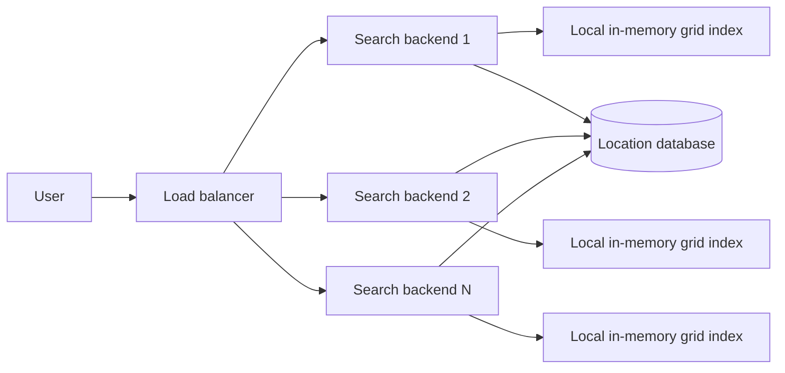

Each backend can answer the grid lookup locally. The database is used only for location details that are not kept in the compact spatial index.

### 3.3 Memory sizing from the lecture

The lecture approximates the Earth's surface area as:

```text
200 million square miles
```

For cells of `10 square miles`:

```text
number of cells = 200M / 10 = 20M cells
```

The compact location record drawn in the notes contains:

```text
location_id = 8 bytes
longitude   = 8 bytes
latitude    = 8 bytes
-----------------------
record      = 24 bytes
```

For `500M` locations:

```text
500M x 24 bytes = 12 GB
```

For the grid IDs:

```text
20M x 4 bytes = 80 MB
```

The location records dominate the memory footprint. The cell-key overhead is relatively small.

### 3.4 Compute sizing formula

The lecture uses:

```text
required cores = QPS x average service time x safety factor
```

At `100,000 QPS`, `150 ms`, and a `1.5` safety factor:

```text
100,000 x 0.150 x 1.5 = 22,500 cores
```

Approximate server counts:

```text
22,500 / 4 cores  ~= 5,625 servers
22,500 / 8 cores  ~= 2,813 servers
```

At `15 ms`:

```text
100,000 x 0.015 x 1.5 = 2,250 cores
```

The lesson is that reducing the lookup from hundreds of milliseconds to milliseconds or microseconds drastically reduces the serving fleet.

### 3.5 Why not query the database for every search?

The notes use an example capacity of about `5,000 QPS` per database replica:

```text
100,000 QPS / 5,000 QPS per replica = 20 replicas
```

A database-only spatial lookup becomes expensive and hard to scale. A dedicated in-memory index removes most geographic lookup traffic from the primary database.

---

## 4. Problems with the fixed-grid design

### 4.1 One cell size cannot fit every region

A small cell size works in dense cities but creates millions of empty cells in oceans, deserts, and rural areas.

A large cell size reduces the number of cells but creates huge candidate lists in dense areas.

### 4.2 Empty-space waste

A uniform fine grid conceptually covers the entire world, even where there are no locations. It does not adapt to the actual data distribution.

### 4.3 Hotspots and skew

A popular city cell can contain an enormous number of locations while most cells contain very few.

Consequences include:

- large candidate scans;
- high distance-calculation cost;
- expensive ranking work;
- uneven memory usage;
- uneven request latency;
- one hot partition becoming a bottleneck.

### 4.4 Boundary problem

A user close to a cell edge may be geographically closer to locations in the neighboring cell than to locations in the current cell.

The query therefore has to inspect neighboring cells, including diagonal neighbors.

### 4.5 No natural hierarchy

A flat grid has no parent-child structure. Supporting different radii or zoom levels requires custom logic for walking more and more surrounding cells.

### 4.6 Resizing is expensive

Changing the global grid size changes many `grid_id` values. A resize can require rewriting hundreds of millions of location assignments and synchronizing all serving replicas.

### 4.7 Memory keeps growing

The notes assume approximately `20%` annual growth:

```text
12 GB -> 15 GB -> 18 GB -> 21 GB -> about 25 GB
```

A design that fits comfortably on one machine today may become unsafe after several years.

---

## 5. Spatial-index alternatives

## 5.1 Geohash

Geohash repeatedly divides the map and encodes a region as a prefix. Longer prefixes represent smaller regions.

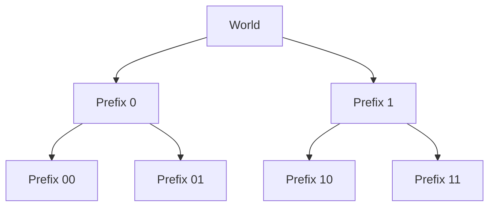

A database can search a prefix using a pattern similar to:

```sql
SELECT *
FROM restaurants
WHERE geohash LIKE '<target-prefix>%'
   OR geohash LIKE '<neighbor-prefix-1>%'
   OR geohash LIKE '<neighbor-prefix-2>%';
```

### Advantages

- simple string or binary representation;
- hierarchical precision;
- easy prefix indexing;
- practical for databases and key-value stores.

### Disadvantages

- nearby points can have very different prefixes at a boundary;
- neighbor enumeration is mandatory;
- cell dimensions vary with latitude;
- dense regions can still become hotspots unless the precision is adapted.

---

## 5.2 Google S2 and Hilbert ordering

Google S2 maps the sphere to cube faces and recursively subdivides each face into hierarchical cells. A Hilbert space-filling curve assigns a one-dimensional ordering while preserving geographic locality reasonably well.

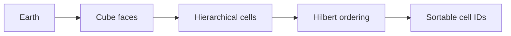

### Advantages

- globe-aware geometry;
- hierarchical cell levels;
- good support for cell coverings and ranges;
- avoids one uniform fine grid everywhere;
- useful for storage and ordered scans.

### Disadvantages

- more complex than a simple grid or Geohash;
- correct covering and neighbor logic are essential;
- one-dimensional ordering cannot perfectly preserve every two-dimensional adjacency.

---

## 5.3 Quadtree

A quadtree recursively divides a 2D region into four equal quadrants. Only regions containing enough data are subdivided.

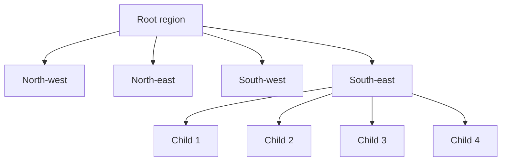

This gives an adaptive structure:

- sparse regions stay as large leaves;
- dense regions split into smaller leaves;
- empty regions need little or no fine-grained structure.

---

# 6. Quadtree generation in detail

## 6.1 Node model

Conceptually, each node contains:

```text
geographic bounding box
up to four child pointers
location list when the node is a leaf
```

The lecture uses a leaf threshold of approximately:

```text
500 locations per leaf
```

The node does not need every property or ranking field. The compact record remains:

```text
location_id
longitude
latitude
```

## 6.2 Recursive generation algorithm

1. Create one root node covering the complete geographic area.
2. Insert locations into the root.
3. If a leaf contains at most `500` locations, keep it as a leaf.
4. If it exceeds `500`, divide its bounding box into four equal quadrants.
5. Create four child nodes.
6. Redistribute every location into the correct child.
7. Remove the location payload from the parent.
8. Repeat the same rule for each child.
9. Stop when every leaf satisfies the threshold or when another safe stopping condition is reached.

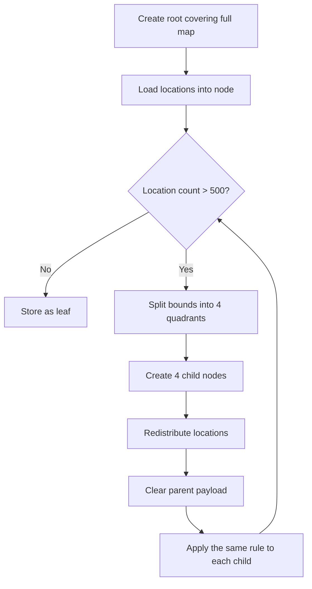

## 6.3 Insertion-oriented pseudocode

```text
function insert(node, location):
    if node is a leaf:
        node.locations.append(location)

        if node.locations.count > LEAF_THRESHOLD:
            split(node)
        return

    child = child_containing(node, location.longitude, location.latitude)
    insert(child, location)


function split(node):
    node.children = create_four_equal_quadrants(node.bounds)

    old_locations = node.locations
    node.locations = empty

    for location in old_locations:
        child = child_containing(node, location.longitude, location.latitude)
        insert(child, location)
```

## 6.4 Bulk-build approach

For a very large dataset, inserting one location at a time into a shared mutable tree may be slow. A bulk generator can partition the dataset recursively:

```text
build(bounds, locations):
    if locations.count <= LEAF_THRESHOLD:
        return leaf(bounds, locations)

    quadrants = divide(bounds into NW, NE, SW, SE)

    groups = partition locations by quadrant

    return internal_node(
        build(NW bounds, groups.NW),
        build(NE bounds, groups.NE),
        build(SW bounds, groups.SW),
        build(SE bounds, groups.SE)
    )
```

This operation is highly parallelizable because the four child groups can be built independently after partitioning.

## 6.5 Why the parent payload is cleared

After a split, keeping the same locations in both the parent and children would duplicate memory and complicate search.

The parent therefore becomes a routing node, while the leaf nodes hold the actual location records.

## 6.6 Preventing pathological splitting

A practical implementation needs stopping safeguards for cases such as many locations sharing the same coordinates.

Possible structural safeguards are:

```text
maximum tree depth
minimum geographic cell size
overflow bucket for identical coordinates
```

These are implementation safeguards around the lecture's threshold rule; they do not add fields to the location schema.

## 6.7 Balanced and unbalanced trees

A quadtree is not necessarily balanced.

- Sparse areas may stop after only a few levels.
- Dense cities may continue for many more levels.
- The adaptive depth is the feature that removes fixed-grid waste.

The lecture estimates roughly `12-16` levels for the discussed scale, depending on data distribution.

---

# 7. Quadtree search algorithm

## 7.1 Point lookup

For a query point:

1. Start at the root.
2. Determine which quadrant contains the query coordinates.
3. Descend into that child.
4. Repeat until reaching a leaf.
5. Read the locations stored in the leaf.
6. Compute exact distances.
7. Keep only locations inside the requested radius.

## 7.2 Radius search and neighboring leaves

A radius can cross the boundary of the target leaf. Therefore the system must search every leaf whose bounding box intersects the query circle.

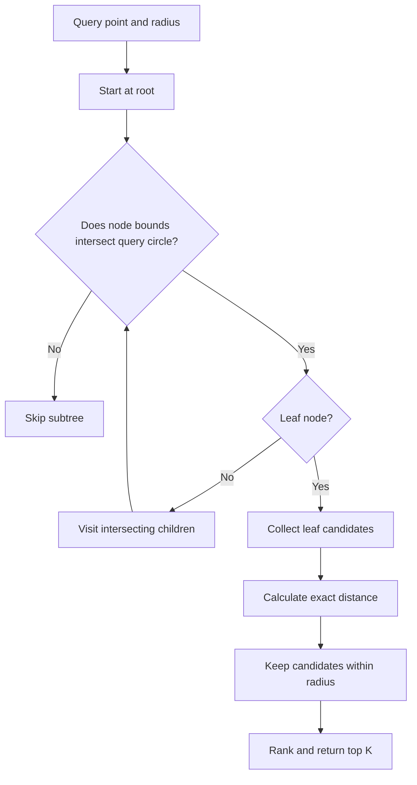

Bounding-box intersection allows the search to prune entire subtrees that cannot contain a match.

## 7.3 Search pseudocode

```text
function radius_search(node, query_point, radius, output):
    if not intersects(node.bounds, query_point, radius):
        return

    if node is a leaf:
        for location in node.locations:
            if exact_distance(location, query_point) <= radius:
                output.add(location.location_id)
        return

    for child in node.children:
        radius_search(child, query_point, radius, output)
```

## 7.4 Exact distance is still required

The tree only produces candidates. A rectangular leaf can intersect the search circle even when some locations inside the leaf are outside the radius.

The final filter must use an exact geographic-distance calculation, such as a great-circle distance formula.

## 7.5 Complexity intuition

For a reasonably distributed tree:

```text
tree descent: approximately O(log4 N)
leaf scan: bounded by the leaf threshold
neighbor work: depends on radius and local density
```

The query may inspect more than one leaf, but it avoids scanning the entire location set.

---

# 8. Quadtree memory calculation

The compact payload is:

```text
500M locations x 24 bytes = 12 GB
```

With a threshold of `500`:

```text
leaf nodes = 500M / 500 = 1M leaves
```

For a full 4-ary tree, the number of internal nodes is approximately:

```text
internal nodes ~= leaves / 3
```

At approximately `32 bytes` of child-pointer storage per internal node:

```text
(1M / 3) x 32 bytes ~= 10.6 MB
```

The important conclusion is:

```text
location payload: about 12 GB
pointer overhead: only about 10.6 MB in the simplified estimate
```

Tree structure is inexpensive compared with the actual location records.

---

# 9. Quadtree advantages and disadvantages

## Advantages

- adapts to real location density;
- avoids allocating fine cells in empty regions;
- supports hierarchical search radii;
- keeps leaf scans bounded by a threshold;
- fast in-memory traversal;
- dense areas can be split without changing every sparse region;
- natural fit for regional partitioning and parallel generation.

## Disadvantages

- the tree can be highly unbalanced;
- radius searches must inspect neighboring/intersecting leaves;
- very dense or identical coordinates need a depth or overflow safeguard;
- updates can trigger splits or structural changes;
- every replica must serve a consistent tree version;
- one global tree eventually becomes too large for one machine;
- serialized tree formats and rollout procedures add operational complexity.

---

# 10. Single-region quadtree serving architecture

Each search backend can keep a complete local in-memory copy of the quadtree for that region.

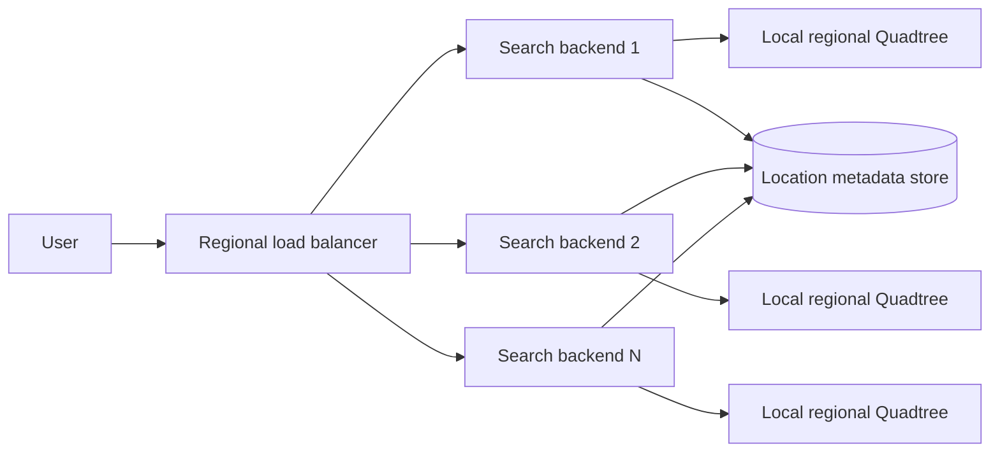

### Request path

```text
1. Receive latitude, longitude, radius, and filters.
2. Traverse the local Quadtree.
3. Collect nearby location IDs.
4. Calculate exact distances.
5. Fetch compact ranking metadata.
6. Rank and return the top results.
```

### Why local memory is fast

- no network call is needed for the tree traversal;
- traversal touches only a small number of nodes;
- each leaf contains a bounded candidate count;
- the database is not used as the geographic index.

### Limitation

Every backend contains the whole regional tree. This is excellent for latency but duplicates memory across all replicas.

---

# 11. Scaling by region and density

A single global tree should be divided into geographic partitions.

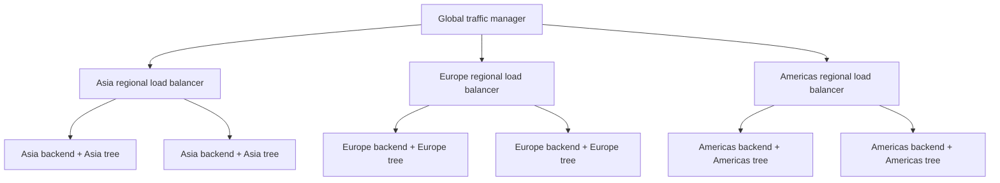

## Benefits

- a server loads only its region;
- lower memory per backend;
- lower latency by serving users near their region;
- independent regional scaling;
- failures can be contained within a region;
- rebuilds can be performed per partition.

## Avoid political boundaries as the only rule

The notes show unequal region sizes, such as examples around `32 GB`, `12 GB`, and `8 GB`.

Static continent or country boundaries can still produce imbalance. Partitions should consider:

```text
number of indexed locations
query traffic
memory size
candidate density
expected growth
```

A dense city can be divided into multiple shards while a large sparse region can remain one shard.

---

# 12. Parallel search with scatter-gather

When one region is too large for a single tree process, divide the region into multiple Quadtree shards.

The aggregator sends the search to all relevant shards in parallel and merges the results.

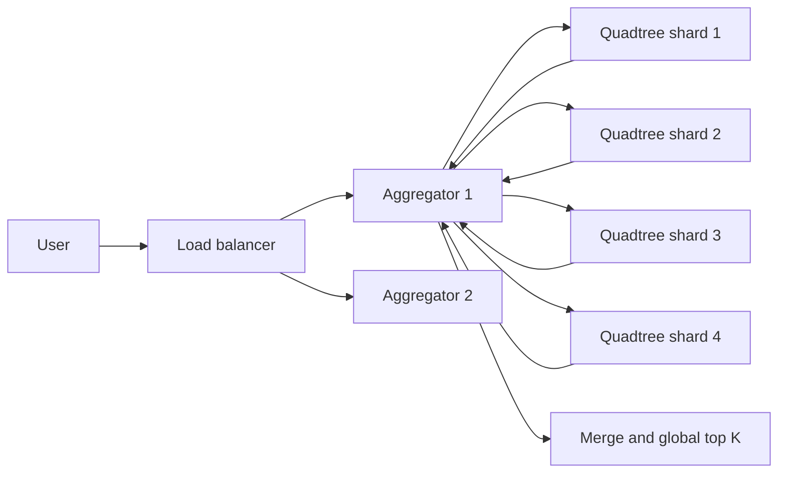

## Query routing optimization

The aggregator should not always fan out to every shard. It can calculate which shard boundaries intersect the query circle and call only those shards.

```text
query circle
    -> intersecting region partitions
    -> intersecting Quadtree shards
    -> parallel local searches
    -> merge candidates
```

## Merge behavior

Each shard can return a local sorted list. The aggregator performs a multiway merge to produce the global top `K`.

```text
shard 1 top K
shard 2 top K
shard 3 top K
        -> global merge -> final top K
```

## Advantages

- one tree no longer has to fit in one process;
- shard work runs concurrently;
- hot shards can be replicated independently;
- larger total throughput;
- shard boundaries can be rebalanced as density changes.

## Trade-offs

- network fan-out adds latency;
- the slowest required shard determines tail latency;
- aggregator capacity becomes important;
- global top-K merging must be correct;
- partial failures require an explicit policy;
- partition imbalance can still create hot shards.

---

# 13. Offline Quadtree generation

The lecture proposes generating the index offline using distributed processing such as Spark or Hadoop.

## 13.1 Generation pipeline

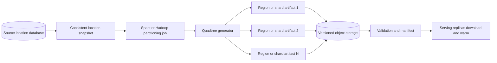

## 13.2 Distributed generation steps

1. Read a consistent snapshot of the source location table.
2. Assign each location to a top-level region or shard.
3. Group records by region or shard.
4. Build each Quadtree partition independently.
5. Serialize each partition into a compact artifact.
6. Produce a manifest containing the complete set of artifacts for one version.
7. Validate counts, geographic bounds, checksums, and sample queries.
8. Publish the version only after all required artifacts pass validation.
9. Serving replicas download the new artifacts into unused memory or a standby process.
10. Warm the tree and run health checks.
11. Atomically switch traffic from the old version to the new version.
12. Keep the previous version available for rollback.

## 13.3 Versioned deployment

Never mutate the only live tree in place during a full rebuild.

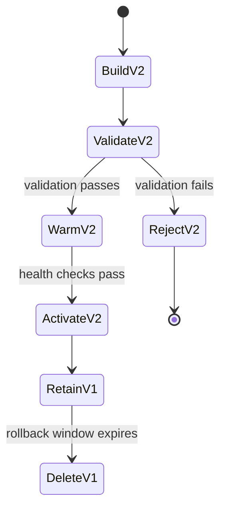

This avoids mixed or partially written trees.

## 13.4 Artifact partition example from the notes

```text
server_1 -> [location_id, location_id, ...]
server_2 -> [location_id, location_id, ...]
```

The important idea is that the generator decides which server or shard owns each part of the tree.

---

# 14. Complete search architecture

The following architecture combines the lecture's Quadtree, regional routing, shard parallelism, offline generation, ranking separation, and replica-based serving.

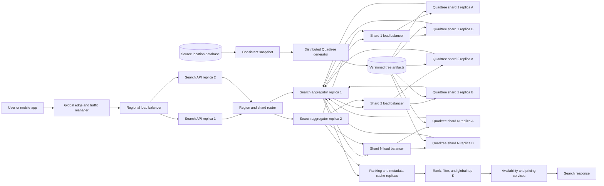

## 14.1 Responsibilities by layer

### Global edge and traffic manager

- chooses a healthy region;
- routes users to the nearest or best available region;
- supports regional failover;
- absorbs connection spikes and basic request filtering.

### Regional load balancer

- distributes requests across stateless Search API replicas;
- removes unhealthy replicas;
- allows horizontal scaling.

### Search API

- validates the query;
- normalizes coordinates, radius, filters, and pagination;
- applies request limits;
- calls the region and shard router.

### Region and shard router

- determines which geographic partitions intersect the query;
- avoids unnecessary fan-out;
- sends the request to an available aggregator.

### Search aggregator

- queries required shards in parallel;
- enforces per-shard deadlines;
- deduplicates candidate IDs when a query crosses boundaries;
- performs exact-distance filtering or coordinates that work;
- merges local sorted results into a global top `K`.

### Quadtree shard replicas

- keep one partition fully in memory;
- traverse the Quadtree;
- return nearby candidate IDs and distances;
- load only validated, versioned artifacts;
- remain stateless with respect to user sessions.

### Ranking and metadata cache

- provides rating, popularity, category, and other compact ranking signals;
- prevents every search from performing large database reads;
- can use separate replicas from the spatial tree.

### Availability and pricing

- runs only for the reduced top candidate set;
- should not be called for every location in an entire leaf or shard;
- remains separate because its data changes at a different rate and has different scaling characteristics.

### Offline generator

- rebuilds region and shard artifacts from the source location snapshot;
- validates a complete version before publication;
- lets replicas load a new version without modifying the active tree.

---

# 15. Highly available and fault-tolerant architecture

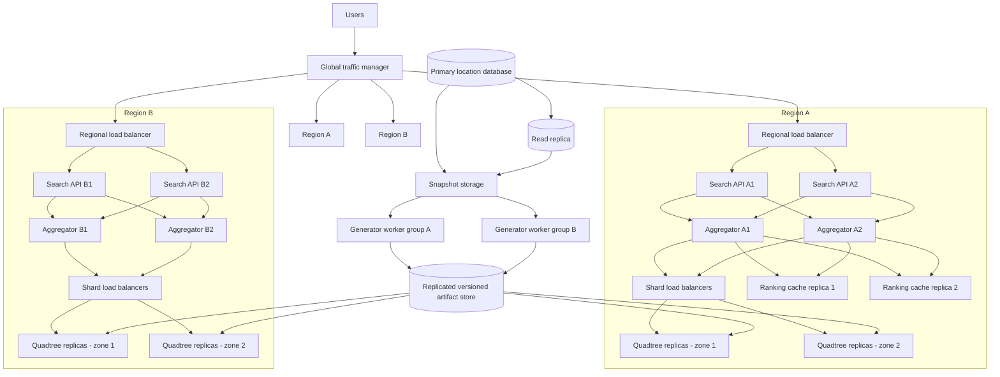

## 15.1 Availability principles

### No single serving replica

Every stateless layer has multiple instances:

```text
Search API replicas
Aggregator replicas
Shard replicas
Ranking-cache replicas
```

A load balancer or service-discovery layer removes unhealthy instances.

### Multiple failure zones

Replicas of the same Quadtree shard should be placed in different availability zones or failure domains.

A zone failure should leave at least one healthy copy of every required shard.

### Regional redundancy

A second region can serve as:

- active-active capacity;
- active-standby disaster recovery;
- a fallback when the nearest region is unavailable.

The global traffic manager must stop sending new requests to an unhealthy region.

### Immutable, versioned trees

Quadtree artifacts are immutable once published. Every replica reports the version it serves.

A regional rollout is considered healthy only when the required shard replicas have loaded the same complete version.

### Rollback

Keep the previous tree version during the rollout window. If validation or production health checks fail, switch replicas back to the previous version.

### Source database independence during search

A temporary source-database outage should not stop nearby search because Quadtree replicas continue serving the last successfully published snapshot.

Some non-indexed metadata may be stale or unavailable, but the core geographic candidate search remains operational.

---

# 16. Failure handling by component

## 16.1 Search API replica failure

**Detection:** load-balancer health check fails.

**Behavior:** remove the instance and route traffic to remaining replicas.

**Requirement:** Search API instances must be stateless or keep user state outside the process.

## 16.2 Aggregator failure

**Detection:** timeout, connection failure, or health-check failure.

**Behavior:** retry once through another aggregator when the remaining request budget permits.

**Protection:** use idempotent read-only search requests and strict deadlines to avoid retry storms.

## 16.3 One Quadtree replica failure

**Detection:** shard load balancer marks the replica unhealthy.

**Behavior:** route to another replica of the same shard.

**Requirement:** every shard needs enough replicas across independent failure domains.

## 16.4 Entire shard unavailable

The product must choose one of two policies:

```text
strict correctness:
    fail the query because the result set is incomplete

best-effort search:
    return partial results with internal partial-result metadata
```

For booking search, silently treating partial data as complete can be misleading. The policy should be explicit and observable.

## 16.5 Slow shard

A slow shard can dominate the response time.

Use:

- per-shard deadlines;
- cancellation of late work;
- hedged requests only when justified;
- shard-level latency metrics;
- replication and rebalancing for consistently hot shards.

## 16.6 Ranking-cache failure

Graceful degradation can return distance-ranked candidates using the spatial result alone, provided the product accepts reduced ranking quality.

The system should not invent unavailable rating or popularity values.

## 16.7 Availability or pricing failure

Possible behavior:

- return property candidates without live price only if the product allows it;
- mark price or availability as temporarily unavailable;
- avoid dropping the entire geographic search when only the enrichment layer is unhealthy.

## 16.8 Source database failure

Current Quadtree snapshots continue serving.

The next rebuild waits until a consistent source snapshot is available. The system must never publish an incomplete tree generated from a partial or inconsistent source read.

## 16.9 Generator failure

The current production tree remains active.

A failed build is discarded. Because artifacts are versioned and published only after validation, a generator failure does not corrupt the serving version.

## 16.10 Artifact-storage failure

Already loaded replicas continue serving from memory.

New instances may be unable to start or load a version, so replicas should keep a local last-known-good artifact where practical and the artifact store itself should be replicated.

## 16.11 Region failure

The global traffic manager sends new traffic to another healthy region.

Capacity planning must reserve enough headroom in surviving regions to absorb failover traffic.

---

# 17. Timeouts, retries, and circuit breakers

A distributed search request should have one end-to-end deadline.

Example budget structure:

```text
edge and API processing
    + shard fan-out
    + candidate merge
    + ranking metadata
    + availability/pricing
    < total request deadline
```

Retries must use the remaining deadline, not restart the full timeout.

Circuit breakers should isolate:

```text
unhealthy shard replicas
slow ranking-cache clusters
failing availability services
unhealthy regions
```

Unbounded retries can multiply traffic during an outage and make the failure worse.

---

# 18. Consistency and version safety

## 18.1 Version manifest

A published tree version should represent a complete set of region and shard artifacts.

```text
version V
    region A / shard 1
    region A / shard 2
    region B / shard 1
    ...
```

A replica should not combine arbitrary shards from different builds unless the compatibility rules explicitly permit it.

## 18.2 Atomic activation

A replica follows:

```text
download -> checksum -> deserialize -> warm -> health check -> activate
```

The active pointer changes only after the new tree is fully ready.

## 18.3 Validation checks

Before publication:

- input location count matches expectations;
- every record belongs to exactly one intended top-level partition;
- leaf thresholds are respected except documented overflow cases;
- artifact checksums are valid;
- geographic bounds are valid;
- sample point and radius queries match a trusted reference implementation;
- no shard artifact is missing;
- memory size remains within serving limits.

---

# 19. Popular-place caching and ranking

The notes show that a small set of popular destinations can receive a very large fraction of searches.

Caching can avoid repeating the same candidate generation and ranking work.

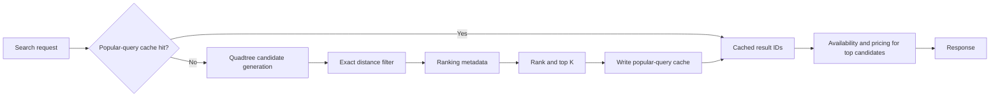

## Cache-key considerations

The key must include every input that materially changes the result, such as:

```text
normalized geographic area or destination
radius
filters
sort mode
result page or top-K size
```

Availability and price often change too frequently to cache for the same duration as geographic candidate IDs. Cache spatial/ranking candidates separately from rapidly changing enrichment where possible.

## Keep the spatial index compact

The lecture first stores only:

```text
location_id
longitude
latitude
```

Adding many ranking fields to every Quadtree replica increases memory from the approximate `12 GB` baseline toward much larger values.

A better separation is:

```text
Quadtree:
    location_id + coordinates

ranking cache/service:
    popularity, rating, and other ranking data

availability/pricing:
    live commercial data for only the top candidates
```

---

# 20. Extracted schemas and data structures

No additional database columns are introduced here.

## 20.1 Location table

```text
location_id
grid_id
```

## 20.2 Fixed-grid in-memory index

```text
key:   grid_id
value: location_id[]
```

## 20.3 Quadtree location record

```text
location_id
longitude
latitude
```

## 20.4 Enriched in-memory or ranking record sketched in the notes

```text
location_id
longitude
latitude
avg_pop
price?
```

The final handwritten field appears to be `price`, but the label is not fully legible.

## 20.5 Generated server or shard partition

```text
server_1 -> [location_id, location_id, ...]
server_2 -> [location_id, location_id, ...]
```

---

# 21. End-to-end request flow

```text
1. User submits latitude/longitude or selects a destination.
2. Global traffic management chooses a healthy region.
3. Regional load balancing chooses a Search API replica.
4. The router calculates which geographic partitions intersect the query.
5. An aggregator queries the required Quadtree shards in parallel.
6. Each shard traverses its local in-memory tree.
7. Shards return candidate IDs and geographic information.
8. The aggregator removes duplicates and calculates or validates exact distance.
9. Ranking metadata is fetched for the reduced candidate set.
10. The aggregator produces a global top K.
11. Availability and pricing are requested only for those top candidates.
12. The final results are returned to the user.
```

---

# 22. End-to-end rebuild and rollout flow

```text
1. Read a consistent source-database snapshot.
2. Partition locations by region and density-aware shard.
3. Build Quadtree partitions in parallel.
4. Serialize immutable artifacts.
5. Validate counts, bounds, thresholds, checksums, and sample queries.
6. Publish one complete version manifest.
7. Replicas download the version without replacing the active tree.
8. Replicas deserialize and warm the new tree.
9. Health checks verify the new version.
10. Traffic switches atomically to the new version.
11. Monitor error rate, latency, memory, and result quality.
12. Roll back to the previous version if required.
```

---

# 23. Observability

The design should expose metrics for:

```text
request QPS and latency by region
p50, p95, and p99 shard latency
aggregator fan-out count
number of shards touched per query
candidate count before and after exact-distance filtering
Quadtree depth distribution
leaf-size distribution
memory per shard and replica
cache hit rate for popular searches
artifact version served by every replica
failed or missing shard calls
partial-result rate
rebuild duration and validation failures
regional failover capacity
```

Important alerts include:

- no healthy replica for a required shard;
- replicas serving inconsistent versions;
- abnormal candidate counts;
- tree memory approaching the machine limit;
- p99 latency dominated by one shard;
- generator output missing a partition;
- a surviving region lacking failover headroom.

---

# 24. Final design summary

The final search system is based on these principles:

```text
Use the database as the authoritative location source.
Use a compact in-memory Quadtree for geographic candidate generation.
Split dense regions more deeply than sparse regions.
Partition large trees by geography and measured density.
Query only intersecting shards and search them in parallel.
Replicate every serving shard across independent failure domains.
Keep aggregators and APIs stateless and horizontally scalable.
Build immutable tree versions offline.
Validate, warm, and atomically activate new versions.
Keep the previous version for rollback.
Separate candidate generation, ranking, and live availability/pricing.
Cache popular searches without placing every business field in the tree.
Design explicit behavior for slow shards, missing shards, database outages,
generator failures, artifact failures, zone failures, and region failures.
```

The most important architectural separation is:

```text
Quadtree -> nearby candidate IDs
Ranking layer -> ordered top candidates
Availability/pricing -> live commercial result for the small final set
```

That separation keeps the spatial index small, fast, rebuildable, and independently scalable while allowing the overall search system to remain highly available and fault tolerant.
