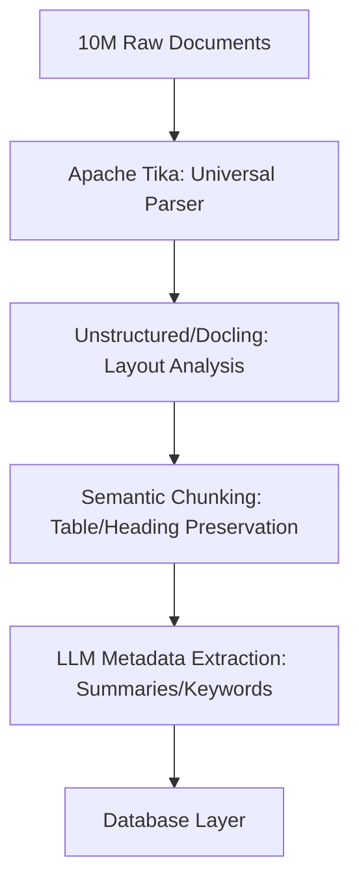
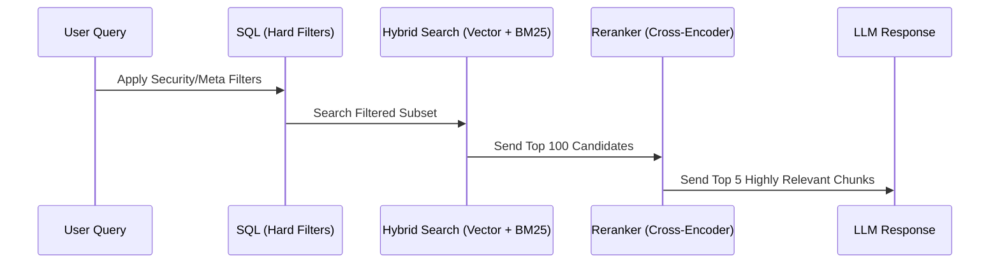
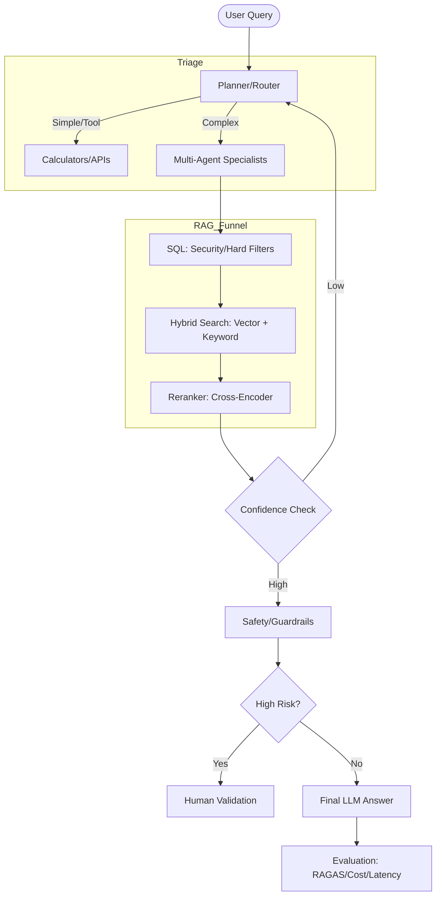

Scaling a Retrieval-Augmented Generation (RAG) system to handle 10 million documents requires transitioning from a simple "laptop-scale" setup to a complex, multi-layered architecture designed to handle messy data, strict security, and performance constraints.

The following architecture is broken down into three core pillars: **Ingestion**, **Storage/Retrieval**, and **Routing/Safety**.

---

### **Pillar 1: The Ingestion Pipeline (The Universal Translator)**
At 10 million documents, ingestion is no longer about simple PDF reading; it is about handling diverse, messy formats like scanned contracts, Slack exports, and nested spreadsheets.

#### **1. Parsing and Structure Discovery**
Instead of custom parsers, the system uses **Apache Tika** as a "universal translator" to extract clean text and metadata in a consistent format. To understand the "shape" of the document, the architecture employs:
*   **Unstructured:** Partitions documents into typed elements (e.g., narrative text, list items, titles).
*   **Docling:** Specifically used for complex PDFs to handle multi-column layouts, table structure recovery, and OCR for scanned content.

#### **2. Semantic Chunking**
Standard character-based splitting fails at scale because it can slice through tables or sentences, losing meaning. The architecture uses:
*   **Table Preservers:** Treat tables as atomic units, often serializing them to Markdown to preserve structure.
*   **Heading & Boundary Detectors:** Ensure chunks break at natural sentence or paragraph ends. A **heading detector** attaches "breadcrumbs" to chunks so they retain context of their original section.
*   **Strategy:** Prioritize **semantic completeness** over fixed metrics like character counts.

#### **3. Metadata Enrichment**
Before storage, an LLM pre-computes summaries, keywords, and hypothetical questions for each chunk. This allows the system to "reverse engineer" retrieval before a user even asks a question.

**Ingestion Workflow Diagram:**

---

### **Pillar 2: Database Layer (The Retrieval Funnel)**
At scale, vector search alone is insufficient. The architecture treats retrieval as a "funnel" to maintain both speed and precision.

#### **1. Relational Filtering (SQL)**
A **SQL database** sits alongside the vector store to handle "hard filters" such as security permissions (e.g., "only HR documents") or date constraints. This narrows 10 million documents down to a few thousand candidates instantly.

#### **2. Hybrid Search**
Vector search (using **HNSW** for approximate nearest neighbors) is excellent for meaning but fails on exact tokens like error codes or acronyms. The system runs **Hybrid Search** by fusing:
*   **Dense Vectors:** For semantic meaning.
*   **BM25 (Keyword Search):** For exact term matching.

#### **3. Reranking**
The top ~100 results from hybrid search are passed to a **Cross-Encoder (e.g., Cohere Rerank)**. This heavier model rescores candidates for actual relevance, catching subtle gaps that pure vector math misses.

**Retrieval Sequence Diagram:**

---

### **Pillar 3: The Brain (Orchestration, Agents, and Safety)**
The system uses a "conditional router" to act as a project manager, ensuring queries are handled efficiently.

#### **1. The Planner and Router**
*   **Planner:** Breaks multi-step missions (e.g., "Summarize latency and email the team") into a checklist.
*   **Conditional Router:** Triages queries. Simple math questions go to a calculator, while complex queries go to the RAG pipeline. This avoids the latency and cost of unnecessary vector searches.

#### **2. Multi-Agent Systems**
For complex tasks, the system spins up specialist agents in parallel (e.g., one for research, one for risk analysis) using frameworks like **Langraph** or **CrewAI**.

#### **3. Reliability and Safety**
*   **Feedback Loops:** If confidence is low, the system loops back to try a different retrieval strategy.
*   **Human-in-the-Loop:** High-stakes or irreversible actions (e.g., wiring money) require human validation.
*   **Red Teaming:** Tools like **Garak** or **Nemo Guardrails** constantly test for prompt injection and biased data.

#### **4. Evaluation**
The system uses "LLM judges" (e.g., **RAGAS**, **TrueLens**) to score every answer for **faithfulness** and **relevance**. It also monitors latency and cost to ensure the system remains commercially viable.

**Complete System Architecture:**

### **Summary of Design Principles**
*   **Consistency over Cleverness:** Use universal tools like Tika for ingestion.
*   **Semantic Completeness:** Chunk data so it retains its original meaning.
*   **Retrieval as a Funnel:** Filter with SQL, search with Hybrid, and refine with Reranking.
*   **Self-Correction:** Use feedback loops and specialist agents to handle complexity.
*   **Security First:** Implement red teaming and human-in-the-loop for risky actions.