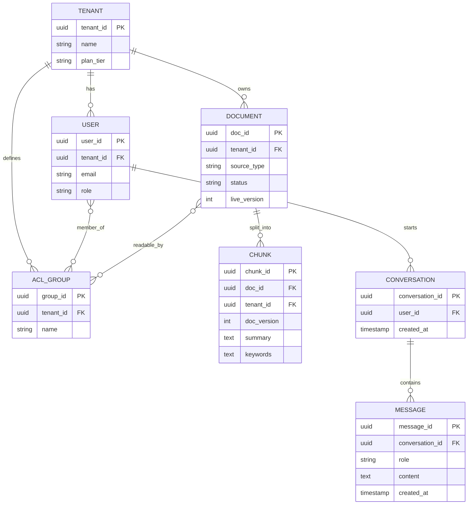
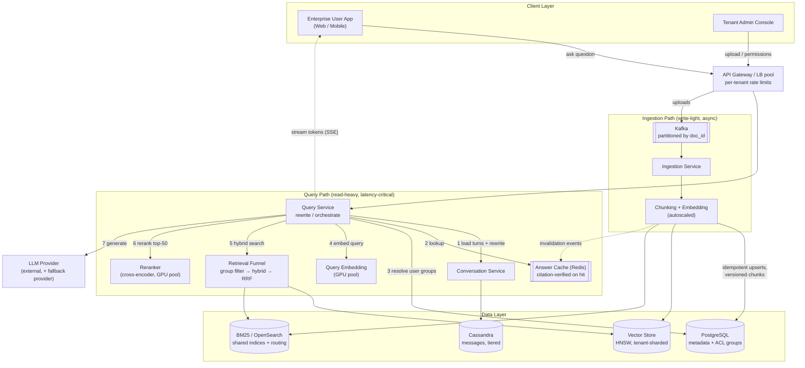
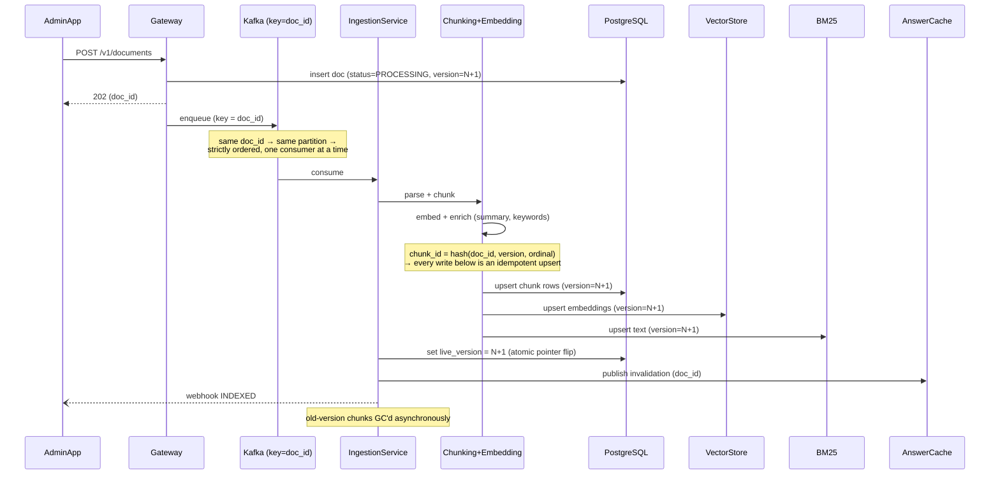
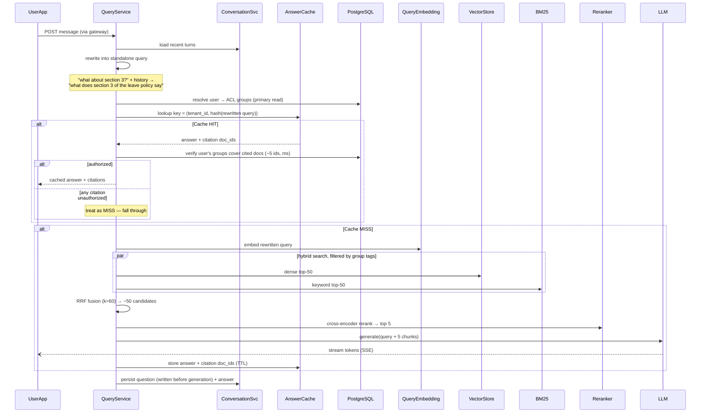
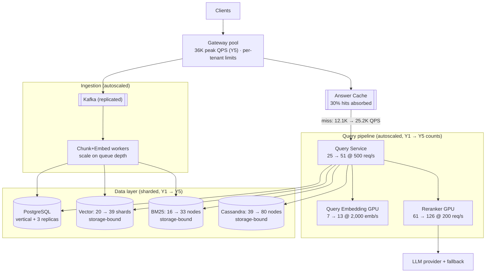

# Multi-Tenant Enterprise RAG Platform
### System Design Capstone — Solution Architecture Document (v2)

---

## 1. Overview

This document designs a **multi-tenant, enterprise-scale Retrieval-Augmented Generation (RAG) platform**: enterprises (tenants) connect their internal document sources, and their employees ask natural-language questions answered from that data, with citations back to source documents.

It generalizes a single-tenant SharePoint-based RAG build (the Bandera GP pattern) into a platform serving ~100,000 tenants, 10M daily active users, and 1B+ indexed chunks.

Two ideas run through every decision in this document:

1. **Tenant isolation is structural, not a filter clause.** Wherever possible, isolation comes from how data is partitioned and keyed, so a single buggy `WHERE` clause can never leak data.
2. **The dominant cost of a RAG platform is not infrastructure — it is LLM tokens.** The cost model in Section 14 shows LLM inference outweighs all servers, databases, and storage combined by roughly 10:1. Several architecture choices (answer cache, top-5 context limit, reranker sizing, tiered storage) exist specifically to control that cost, and each one states the trade-off it accepts in exchange.

---

## 2. Functional Requirements

- Tenants can upload or connect document sources (SharePoint, PDFs, wikis, Slack exports)
- The system chunks, embeds, and indexes documents per tenant, with strict isolation between tenants
- Users ask natural-language questions and receive answers grounded in their tenant's documents, with citations to source chunks
- Multi-turn conversations: follow-up questions retain context
- Tenant admins manage document permissions; some documents are restricted to specific user roles
- Incremental re-indexing when source documents are updated or deleted
- Documents can be deleted, and deletion propagates to every index and cache

## 3. Non-Functional Requirements

- **Query latency:** P95 time-to-first-token < 1s; P95 full answer < 3s (budgeted stage-by-stage in Section 12)
- **Tenant isolation:** no cross-tenant data leakage — the standout NFR
- **Permission correctness:** permission checks are strongly consistent at query admission; a revocation mid-generation takes effect on the next request (a bounded window of one in-flight query, stated as an accepted trade-off, not an oversight)
- **Indexing consistency:** eventual — new or updated documents searchable within minutes
- **Availability:** high availability on the query path (revenue-facing); ingestion may degrade to a backlog, never to data loss
- **Scale:** 100M+ documents, 10M DAU at Year 1, growing 20%/year
- **Cost:** LLM and embedding spend must be bounded and measurable (Section 14 quantifies this)

---

## 4. Assumptions & Scale

### User and corpus assumptions
- 100M total users, 10M DAU (10% — reasonable for a B2B tool used during work hours)
- ~100,000 tenants (100M ÷ ~1,000 average users per tenant); tenant sizes are skewed — a small number of "whale" tenants hold millions of documents each
- 100M documents at Year 1, ~10 chunks per document → **1B chunks**

### Qualification against the project scale floor

The assignment requires ≥ 20,000 QPS or ≥ 10M DAU. This design clears both at Year 1: **10M DAU**, **30,371 peak read QPS**, and **37,454 peak write QPS** (tables below). The headline query-only number (17,350) is a subset of total system load, not the whole of it.

### Query volume (read path)

- 20 queries per active user per day → 10M × 20 = **200M queries/day**
- Enterprise usage concentrates in business hours: ~8 effective peak hours (28,800s) → 200M ÷ 28,800 ≈ **6,940 QPS** business-hour average
- Peak-within-peak multiplier ×2.5 → **~17,350 QPS peak (Year 1)**

### Per-action QPS breakdown

**Reads:**

| Action | Per user/day | Total/day | Business-hour avg QPS | Peak (×2.5) |
|---|---|---|---|---|
| Submit query | 20 | 200M | 6,940 | 17,350 |
| Load conversation history | 10 | 100M | 3,472 | 8,681 |
| View citation / source document | 5 | 50M | 1,736 | 4,340 |
| **Total reads** | | **350M** | **12,148** | **30,371** |

**Writes:**

| Action | Volume/day | Window | Avg QPS | Peak (×2.5) |
|---|---|---|---|---|
| Store message (question + answer = 2 rows per query) | 400M | Business hours — writes track user activity | 13,889 | **34,722** |
| Create conversation | 30M (3/user) | Business hours | 1,042 | 2,604 |
| Document ingestion | 500,000 (0.5% of corpus/day) | Full 24h — background sync | 5.8 | ~12 |
| Permission/metadata updates | 5M | Full 24h | 58 | ~116 |
| **Total writes** | | | **~14,995** | **~37,454** |

Three things this breakdown surfaces:

1. **Message writes are the largest single QPS figure in the system** (34,722 peak Year 1, ~72,000 by Year 5) — larger than query reads, because every question produces two rows. This is what justifies Cassandra on the conversation path.
2. **History reads and citation views never enter the retrieval funnel.** No embedding, no vector search, no reranker, no LLM. Only the query-submission line drives the sizing of the expensive pipeline in Section 12.
3. Message writes are averaged over business hours, not 24 hours, because they happen exactly when users are active. Averaging them over a full day would understate peak by ~3×.

### 20%/year growth — 5-year projection

| Year | DAU | Docs | Chunks | Queries/Day | Business-hr Avg QPS | Peak QPS (×2.5) |
|---|---|---|---|---|---|---|
| 1 | 10.00M | 100.0M | 1.00B | 200.0M | 6,940 | 17,350 |
| 2 | 12.00M | 120.0M | 1.20B | 240.0M | 8,328 | 20,820 |
| 3 | 14.40M | 144.0M | 1.44B | 288.0M | 9,994 | 24,984 |
| 4 | 17.28M | 172.8M | 1.73B | 345.6M | 11,992 | 29,981 |
| 5 | 20.74M | 207.4M | 2.07B | 414.7M | 14,391 | **35,977** |

**Decision:** one uniform 20%/year growth rate across users, documents, and queries.
**Why:** a single growth knob keeps every derived number internally consistent; independent rates per dimension would each need evidence that doesn't exist at design time.
**Trade-off:** corpus growth (tenant onboarding) and query growth (engagement) can diverge in reality. Stated as a simplification, not hidden.

---

## 5. Entities, Schema & Storage

### Entity-Relationship Diagram



**Change from a per-user permission table to ACL groups.** v1 modeled `PERMISSION(doc_id, principal_id)` rows and had the query path fetch "allowed doc_ids." That works for small tenants and collapses for whales: a user in a 5M-document tenant with access to 4M of them would need 4M doc_ids passed as a search filter — not feasible. The group model inverts it (Section 9): documents carry a short list of readable-by group tags, indexed in the vector store and BM25; the query path resolves the *user's group memberships* (a handful of rows, strongly consistent) and filters search on those tags. Permission checks stay strong; filter payloads stay tiny regardless of tenant size.

### Storage engine split

| Data | Engine | Why |
|---|---|---|
| Tenant, User, Document, ACL group, Chunk metadata | PostgreSQL | ACID for permission changes; B-tree indexing fits the equality/range access patterns |
| Chunk embeddings | Vector store (HNSW) | B-trees compare ordered scalars; similarity in 768-dimensional space needs a graph-based ANN index |
| Keyword/exact-match index | BM25 (OpenSearch) | Catches exact tokens (error codes, SKUs, acronyms) that dense embeddings miss |
| Conversations/Messages | Cassandra | 400M append-only rows/day, always read as a time-ordered range per conversation — an LSM write path fits, a B-tree fights it |

### Row-level storage calculations (Year 1)

**`tenant`:** 172 B × 100K rows ≈ **17 MB**

**`user`:** 268 B × 100M rows ≈ **26.8 GB**
Composite B-tree on `(tenant_id, last_active_at)`: equality column first, range column second — the B-tree narrows to one contiguous leaf range per tenant. Reversed order would force a cross-tenant scan.

**`document`:** 792 B × 100M rows ≈ **79 GB**
Composite B-tree on `(tenant_id, status, updated_at)` — directly serves incremental re-indexing ("active docs in tenant X updated since Y").

**`acl_group` + memberships + doc-group mappings:** ~300M small rows ≈ **12 GB**
Clustered on `(user_id)` for the hot "resolve this user's groups" lookup — the one strongly consistent read every query makes.

**`chunk_metadata`:** 3,064 B/row (2,064 base + ~1,000 for summary/keywords/hypothetical-questions enrichment, Section 10) × 1B rows ≈ **3.06 TB**
**Indexing decision — BRIN, not B-tree, on `doc_id`.** At 1B rows a B-tree costs ~350–400 GB by itself and pays a random write on every insert. Chunk ingestion is append-only and physically correlated with insert order, so BRIN (min/max doc_id per block range) delivers the "all chunks for doc X" scan for a few MB of index. A separate B-tree on `tenant_id` remains for offboarding, where access isn't physically contiguous.

**Vector store:** 3,104 B/vector (768-dim float32 + keys + group tags) × 1B ≈ 3.1 TB raw; HNSW graph overhead ~2× (M=16) ≈ 6.2 TB; ×3 replication ≈ **18.6 TB**

**BM25 index:** ~2 KB text × 1B chunks × 1.3 inverted-index overhead ≈ 2.6 TB; ×3 ≈ **7.8 TB**

**Cassandra messages:** 2,138 B/row × 400M rows/day ≈ **855 GB/day raw**
Schema: `PRIMARY KEY ((conversation_id), created_at)` — a full thread lives on one node, clustering returns it pre-sorted, and 10–15 messages per conversation keeps partitions far below Cassandra's ~100K-row soft limit.

**Tiered retention:** 30-day hot (Cassandra, RF=3) + 60-day cold (compressed 4:1, erasure-coded ×1.3 on object storage), then purged under a per-tenant retention policy (default 90 days; compliance export available before purge).
- Hot: 855 GB × 30 × 3 = **77.0 TB**
- Cold: 855 GB × 60 ÷ 4 × 1.3 = **16.7 TB**
- Flat 90-day Cassandra RF=3 would be 231 TB; tiering carries the same data for **93.7 TB — a 59% cut on the platform's largest storage line.** Cold reads are slower; conversations older than 30 days are rarely reopened, so that cost lands on almost nobody.

### Platform storage — Year 1 and 5-year footprint

| Store | Year 1 | Notes |
|---|---|---|
| PostgreSQL | 3.19 TB | chunk metadata dominates (3.06 TB) |
| Vector store (×3) | 18.60 TB | |
| BM25 (×3) | 7.80 TB | |
| Messages (tiered) | 93.70 TB | rolling 90-day window |
| **Total** | **123.3 TB** | |

| Year | PostgreSQL | Vector | BM25 | Messages | **Platform footprint** |
|---|---|---|---|---|---|
| 1 | 3.19 | 18.60 | 7.80 | 93.70 | **123.3 TB** |
| 2 | 3.83 | 22.32 | 9.36 | 112.44 | **147.9 TB** |
| 3 | 4.59 | 26.78 | 11.23 | 134.93 | **177.5 TB** |
| 4 | 5.51 | 32.14 | 13.48 | 161.92 | **213.0 TB** |
| 5 | 6.61 | 38.56 | 16.18 | 194.30 | **255.6 TB** |

This is **point-in-time footprint, not cumulative accumulation** — messages are a rolling 90-day window, so each year's figure is that year's steady state.

**Key finding:** message history dominates storage every year, not embeddings — the intuitive worry ("vectors will explode") is wrong for this system. PostgreSQL grows 3.19 → 6.61 TB over five years and never needs sharding; only the vector store, BM25, and Cassandra scale horizontally.

---

## 6. High-Level Architecture



Layout notes: the query path and ingestion path share no services — only data stores. The gateway box represents a redundant pool behind DNS/anycast, drawn as one box for clarity (Section 12's SPOF table makes this explicit). Answer streaming (dashed) reduces perceived latency: the user sees the first token in ~1s while full generation completes within the 3s budget.

---

## 7. API Design

All endpoints are versioned under `/v1`. **`tenant_id` is never a client-supplied parameter** — it is derived from the JWT, so a client cannot address another tenant's resources even with a forged ID. This is the same isolation-is-structural principle applied at the API surface.

**Ask a question (streaming):**
```
POST /v1/conversations/{conversation_id}/messages
Authorization: Bearer <jwt>            # carries tenant_id + user_id
{ "content": "What is our parental leave policy?" }

→ 200, Content-Type: text/event-stream
data: { "delta": "Full-time employees receive..." }
...
data: { "done": true, "message_id": "uuid",
        "citations": [ { "doc_id": "uuid", "chunk_id": "uuid", "title": "HR Policy 2025", "page": 12 } ] }
```

**Create a conversation:**
```
POST /v1/conversations            → 201 { "conversation_id": "uuid" }
GET  /v1/conversations/{id}/messages?limit=50   → time-ordered messages
```

**Upload a document (async, 202 pattern):**
```
POST /v1/documents
{ "source_type": "pdf", "title": "HR Policy 2025", "acl_groups": ["hr-all", "managers"] }
→ 202 { "doc_id": "uuid", "status": "PROCESSING" }

GET  /v1/documents/{doc_id}       → { "status": "PROCESSING | INDEXED | FAILED", "live_version": 3 }
```

**Permissions and deletion:**
```
PATCH  /v1/documents/{doc_id}/permissions   { "acl_groups": ["hr-all"] }   → 200
DELETE /v1/documents/{doc_id}                → 202 (async purge, Section 8)
```

The 202 pattern on write endpoints matches the NFRs: ingestion is eventually consistent, so the API never blocks a client on embedding compute; status is polled or pushed via webhook.

---

## 8. Request Flows

### Flow 1: Document Ingestion (and re-ingestion)



Three correctness decisions, each closing a specific failure:

**Per-document ordering (Kafka key = doc_id).** Without it, a document updated twice in quick succession runs two pipeline executions concurrently, and their writes interleave across three independent stores — the index ends up holding a mix of v1 and v2 chunks. Partitioning by doc_id serializes updates per document while different documents still process in parallel. Trade-off: a whale tenant bulk-updating one huge document processes it single-file; acceptable, because cross-document parallelism is where the real throughput lives.

**Deterministic chunk IDs → idempotent writes.** Kafka delivers at-least-once. If chunk IDs were random per run, a redelivered message would duplicate every chunk in all three stores, silently doubling that document's retrieval weight. `hash(doc_id, version, ordinal)` makes a retry converge to the same rows instead of new ones. This costs nothing and removes an entire failure class.

**Versioned chunks + atomic pointer flip.** There is deliberately no distributed transaction across PostgreSQL, the vector store, and BM25 — coordinating one would be slow and fragile. Instead, new-version chunks are written alongside old ones, invisible to queries (which filter on `live_version`), and a single PostgreSQL update flips the pointer. A crash mid-ingestion leaves harmless invisible rows that the retry overwrites and the GC sweeps. Readers never see a mixed state.

**Deletion** follows the same machinery: `DELETE` sets the document tombstoned in PG (instantly invisible to the group filter), publishes cache invalidation, and enqueues async purge — BM25 delete-by-doc_id, vector-store soft-delete with periodic HNSW segment compaction (HNSW deletes are tombstones; the graph needs occasional rebuild to reclaim quality and space), and chunk-row removal. Tenant offboarding runs the same purge scoped by the `tenant_id` B-tree.

### Flow 2: Query & Retrieval



**Decision: query rewriting happens before the cache, and the cache key uses the rewritten query.**
**Why:** two reasons, one functional and one correctness. Functionally, multi-turn context (an FR) requires condensing "what about the deadline?" plus history into a standalone query before any retrieval. For correctness: the raw text "what about the deadline?" means different things in different conversations — caching on raw text would serve conversation A's answer to conversation B. Rewriting first makes the cache key context-complete, and normalizes phrasing variants onto the same key, which *raises* the hit rate.
**Cost:** one small-model call per query (~150ms, ~$0.01/1K queries at small-model pricing) buys both the multi-turn FR and cache safety. Cheap.

**Decision: the cache stores citations, and every hit is permission-verified before serving.**
**Why:** this is the fix for the most dangerous failure in the v1 design. A tenant-keyed cache prevents *cross-tenant* leaks but not *intra-tenant* ones: a VP's answer derived from a restricted document would be served to an intern in the same tenant asking the same question. Verifying the ~5 cited doc_ids against the requesting user's groups is a single indexed PostgreSQL lookup (single-digit ms).
**Impact:** the cache skips the **expensive** path (embedding, search, rerank, LLM ≈ full pipeline cost) but never the **security** path. Permission strong-consistency holds for cached and uncached answers alike.
**Trade-off:** a few milliseconds per hit, and hits where the requester lacks access degrade to misses. Both trivial next to the alternative, which is a standing violation of the platform's headline NFR.

**Decision: event-driven cache invalidation on document update, deletion, or permission change — TTL is the backstop, not the mechanism.**
**Why:** TTL alone gives revoked permissions and deleted documents an afterlife equal to the TTL. Ingestion and permission endpoints publish `(doc_id)` invalidation events; a small reverse index (doc_id → cache keys citing it) purges affected entries in seconds.
**Trade-off:** one more Redis structure to maintain. Accepted — a deleted document that keeps answering questions is a compliance incident, not a caching quirk.

**Decision: this is an exact-match answer cache on the rewritten query, not a similarity cache — named honestly.**
**Why:** a hash key is exact-match; calling it "semantic" would misdescribe the mechanism. A true similarity cache (embed the query, nearest-neighbor over cached queries) still pays the embedding cost on every request and adds a wrong-answer risk when similarity clears the threshold but intent differs — a bad trade for a system whose answers carry citations.
**Assumption:** 30% hit rate, stated as a planning assumption. Enterprise question distributions are heavily repeated (policy lookups, onboarding questions), and rewrite normalization folds phrasing variants together. **Sensitivity:** at 15% the pipeline sees 30.6K rather than 25.2K peak QPS at Year 5 (+21%) — absorbed by autoscaling headroom plus gateway admission control (Section 13). The design does not fall over if the assumption is wrong; it costs more.

---

## 9. Permission Model — ACL Group Tags

The mechanism deserves its own section because it serves the standout NFR and it is where naive RAG designs fail at scale.

**How it works:**
1. Documents carry a short list of `acl_group` tags (e.g., `["hr-all", "managers"]`), assigned at upload and editable via `PATCH`. Tags are written into the vector store and BM25 as filterable chunk metadata at ingestion time.
2. At query time, the Query Service resolves the **user's group memberships** from PostgreSQL — a handful of rows, read from the primary, strongly consistent.
3. Vector and BM25 searches filter on `tenant_id + group tags`. The filter payload is a few group IDs regardless of whether the tenant has 100 documents or 5 million.

**Why not "fetch allowed doc_ids and filter on those":** for a whale tenant, the allow-list is millions of IDs — unusable as a search predicate. Group tags compress the permission set to its natural size (organizations manage access by role, not per-document per-user).

**Consistency split, stated precisely:**
- *Membership changes* (user joins/leaves a group — the common, security-critical event: someone leaves the company) take effect on the **next query**, because membership is resolved fresh from the primary every time. Strong consistency where it matters most.
- *Document retag events* (a doc moves from `managers` to `hr-all`) propagate to the search indices asynchronously, within the same "minutes" bound as indexing itself, with cache invalidation fired immediately. Eventual consistency where the NFR already allows it.

**Filter-before-search, never post-filter.** Group filtering executes inside the vector/BM25 query, so an unauthorized chunk never appears in any candidate list — matching the production pattern where permissions propagate into the retrieval engine itself rather than being checked at the UI layer.[^1] Post-filtering would briefly hold unauthorized chunks in memory and, worse, silently return fewer than k results when many candidates get filtered away.

---

## 10. Retrieval Pipeline — What Was Adopted, and What Deliberately Wasn't

A community-sourced retrieval-mechanism reference proposed three pillars: ingestion enrichment, a storage/retrieval funnel, and an orchestration/safety layer. Each was evaluated against this system's requirements:

**Adopted — metadata enrichment at ingestion.** An LLM pre-computes a summary, keywords, and hypothetical questions per chunk, so a vague question can match a chunk whose raw text never contained those words. This is why `chunk_metadata` grew from 2,064 to 3,064 B/row (Section 5): ~1 TB of extra PostgreSQL storage purchased a real recall improvement. Cost lens: enrichment runs once per chunk at ingestion (~6 docs/sec), not per query at 17K QPS — the cheap side of the pipeline is the right place to spend LLM tokens.

**Adopted — hybrid search (dense + BM25) with reranking.** Dense vectors miss exact tokens; BM25 catches them. The funnel narrows in three stages: group filter (structural) → hybrid top-50 per arm → RRF fusion → cross-encoder rerank → top 5. The same hybrid pattern runs in production in Salesforce's Einstein Copilot Search, where semantic and keyword retrieval are combined so results match intent while exact contextual data is preserved.[^2]

**Adopted — top-5 context limit as a cost control.** Section 14 shows input tokens dominate LLM spend. Sending the top 5 reranked chunks (~2K tokens) instead of a fat top-20 context (~8K tokens) cuts the largest cost line in the platform by ~4× at equal or better answer quality — the reranker exists precisely so that fewer, better chunks reach the expensive model. This is the clearest example in the design of a component (reranker GPU pool) whose cost is justified by the larger cost it removes (LLM input tokens).

**Deliberately not adopted — Planner/Router/multi-agent orchestration.** Architecturally sound, out of scope: it advances no stated FR or NFR at this scale, and every added hop in the hot path spends latency budget the P95 target cannot spare. Noted as an extension point, not designed — over-engineering is a rubric failure, not a flex.

---

## 11. Key Decisions

### Retrieval & Indexing

| Decision | Why | Impact | Trade-off / Cost angle |
|---|---|---|---|
| **HNSW** for vector search | O(log N) approximate NN vs O(N) brute force at 1B+ chunks; recall/latency tunable via `ef_search` | Sub-100ms vector search at billion scale | Approximate — small tunable recall loss. Memory-resident graphs make vector nodes RAM-priced; the 2× graph overhead is paid in hardware |
| **Hybrid search** (dense + BM25) | Embeddings miss exact tokens (error codes, SKUs); production-validated pattern[^2] | Closes a real recall gap | One extra store to run and keep in sync — accepted operational cost |
| **RRF (k=60)** to merge result lists | Cosine and BM25 scores live on incomparable scales; rank-based fusion needs no re-tuning as distributions drift | Stable, scale-agnostic merge | Discards score magnitude — fine, the cross-encoder re-scores immediately after |
| **Rerank top-50, not top-100** | Halves cross-encoder compute per query for negligible recall loss after RRF fusion of two top-50 arms | Reranker pool: 126 instead of 252 GPU instances at Year 5 | Rare tail queries might lose a relevant candidate ranked 51–100 — accepted; the GPU pool is the priciest compute per unit in the system |
| **Tenant-sharded** vector index | Every query is single-tenant; a global graph wastes traversal on irrelevant neighbors and makes isolation depend on a filter being bug-free | Isolation is structural; blast radius of a shard failure is a set of tenants, not the platform | Tiny tenants get graphs barely worth HNSW; whale tenants need the split below |
| **Whale-tenant sub-sharding** | A 5M+ doc tenant on one shard is a hot, oversized shard | Tenants above ~1M chunks split by secondary hash on chunk_id across shards — the celebrity-user pattern applied to tenants | Whale queries fan out to a few shards and merge — small latency cost paid only by the tenants causing the skew |
| **Consistent hashing** for tenant→shard | Modulo reshuffles nearly all tenants on any node change | Adding a node remaps only the affected ring segment | Slightly more code than modulo; standard libraries make it cheap |
| **BM25: shared indices + tenant routing**, not index-per-tenant | 100K tenants = 100K indices would blow up OpenSearch cluster state (practical ceiling is a few thousand) | Tenants share indices, routed and filtered by tenant_id; whales get dedicated indices | Shared-index tenants are one filter away from each other on this store — mitigated by routing + the group filter; whales, the highest-value targets, remain fully separated |

### Conversation & Storage

| Decision | Why | Impact | Trade-off / Cost angle |
|---|---|---|---|
| **Cassandra** for messages | 400M append-only rows/day (34.7K peak writes/sec Y1, ~72K Y5), always read as one time-ordered partition | Handles peak writes without contention | Weak at arbitrary ad-hoc queries — messages are never queried that way |
| Partition `(conversation_id)`, cluster `(created_at)` | Thread co-located on one node, returned pre-sorted | Conversation load = one single-partition read | Requires conversation_id at query time — always true here |
| **Tiered retention** (30d hot + 60d cold + purge) | Recency-biased access; RF=3 replication of cold data is money spent replicating what nobody reads | 231 TB → 93.7 TB on the largest storage line (−59%) | Cold reads slower; purge-at-90d must be a stated, per-tenant-configurable policy for compliance |
| **Answer cache** (Redis, exact-match on rewritten query, citation-verified) | Repeat questions shouldn't re-run embed + search + rerank + LLM | ~30% of peak QPS never touches the expensive path; ~$1.1M/month LLM savings vs ~$10K/month Redis cost (Section 14) | Staleness bounded by event-driven invalidation + TTL backstop; per-hit ACL check costs ms |

### Data Durability & Recovery

| Store | Replication | Consistency | Backup |
|---|---|---|---|
| PostgreSQL | Primary + 3 read replicas, managed auto-failover | ACL/membership reads and permission writes on primary; other metadata reads on replicas | WAL continuous archive + daily snapshot |
| Vector store | RF=3 | Writes quorum; reads eventual (latency-first) | Nightly snapshot to object storage |
| BM25 | 1 primary + 2 replica shards | Writes primary, async replicate; reads any | Daily snapshot API to object storage |
| Cassandra | RF=3 | Writes QUORUM, reads ONE | Cold tier doubles as archive; no separate backup job |

---

## 12. Scalability & Load Management



### Every number, derived — Year 1 and Year 5 side by side

The v1 draft mixed Year-5 traffic with Year-1 storage on one diagram. Fixed: every component below is sized at both horizons, and the growth table in Section 4 is what moves the numbers.

| Component | Sizing basis | Year 1 | Year 5 | Bound by |
|---|---|---|---|---|
| Pipeline QPS after cache | peak × 0.7 | 17,350 → **12,145** | 35,977 → **25,184** | — |
| Query Service | 500 req/s/instance (orchestration) | **25** | **51** | throughput |
| Query Embedding | 2,000 embeds/s per GPU (batched bi-encoder, short inputs) | **7** | **13** | throughput |
| Reranker | 200 req/s per GPU = 10K pair-scores/s (50 candidates, 256-token truncation, fp16, batch 64) | **61** | **126** | throughput |
| Vector store | 1 TB/shard | 18.6 TB → **20** | 38.6 TB → **39** | **storage** (throughput alone: 3 → 6) |
| BM25 | 0.5 TB/node | 7.8 TB → **16** | 16.2 TB → **33** | **storage** (throughput alone: ~3 → 6) |
| Cassandra | 2 TB/node hot tier | 77 TB → **39** | 160 TB → **80** | **storage** (throughput @2K writes/s/node: 18 → 36) |
| PostgreSQL | vertical + 3 replicas | 3.19 TB | 6.61 TB | neither — see below |

**The key finding: the data layer is storage-bound, not throughput-bound.** Every stateful store needs 2–6× more nodes for capacity than its query load alone would demand — throughput headroom comes along free. The one place this narrows is Cassandra at Year 5 (80 storage-bound vs 36 throughput-bound), which is exactly why the tiered-retention decision matters: without it, the hot tier would be 2.5× larger and the node count would follow.

**The query-side embedding pool exists because someone has to embed 25K queries/sec.** v1 modeled embedding as an ingestion-only concern (~12 docs/sec) and silently assumed query vectors appear for free. They don't: at Year 5 peak, query embedding is 25,184 GPU inferences/sec — unmodeled, it would have been the largest surprise cost in the system. Self-hosted on ~13 GPU instances it is a rounding error next to the reranker; as external API calls it would add ~$8K/day. Model it, then choose self-hosting.

**PostgreSQL stays vertical.** The hot per-query read is group-membership resolution — a few rows from a ~12 GB table that lives entirely in buffer cache, served by the primary at up to ~25K lookups/sec at Year-5 peak. That is comfortable for a single well-provisioned instance on an indexed point lookup, and the honest statement is: this makes the primary a query-path dependency, so it appears in the SPOF table below with its failover story. Sharding a 6.6 TB metadata store to avoid a dependency that managed failover already covers would be spending complexity where no requirement asks for it.

### Latency budget — the 3s NFR, itemized (cache-miss path, P95)

| Stage | Budget |
|---|---|
| Gateway + auth | 10 ms |
| Load recent turns + rewrite (small model) | 150 ms |
| Cache lookup (miss) | 2 ms |
| Group resolution (PG primary, indexed) | 5 ms |
| Query embedding (GPU, batched) | 15 ms |
| Hybrid search (vector ∥ BM25, parallel) | 80 ms |
| RRF fusion | 1 ms |
| Rerank 50 candidates | 60 ms |
| **Pre-generation total** | **~325 ms** |
| LLM time-to-first-token | ~500 ms → **first token < 1 s** ✓ |
| LLM full generation | ~2,000 ms → **full answer < 3 s** ✓ (~675 ms headroom) |

Cache-hit path: ~30 ms total. The budget also shows *why* the reranker is the component to watch: it is the last synchronous stage before the LLM, so any queueing there eats generation headroom one-for-one.

### Horizontal vs. vertical — summary

| Component | Direction | Why | Trade-off |
|---|---|---|---|
| PostgreSQL | Vertical + replicas | Metadata small (6.6 TB @ Y5); hot ACL table fits in RAM | A real ceiling exists; the growth model shows no path to it in 5 years, and migrating later is disruptive — accepted with eyes open |
| Vector store | Horizontal (tenant-sharded, consistent hashing) | 1B+ vectors; graphs must partition | No cross-tenant search — no FR wants one |
| BM25 | Horizontal (shared indices + routing) | Same driver | Cluster-state ceiling forces shared indices; whales get dedicated ones |
| Cassandra | Horizontal (RF=3) | 72K peak writes/s @ Y5 rules out vertical | Multi-node operational weight — no vertical alternative exists |
| Chunk+Embed workers | Horizontal behind queue | Compute-bound; scale on queue depth | Cold-start lag on bursts — the queue absorbs the gap by design |
| Reranker / Embedding | Horizontal GPU pools | Inference-bound | Most expensive compute per unit; over-provisioning here is the costliest scaling mistake available — hence top-50 not top-100 |

### Bottlenecks

- **Reranker:** heaviest synchronous hot-path stage (126 Y5 instances vs 51 Query Service). Sits after parallel search and before the LLM, so every query pays it serially — under-provisioning inflates P95 directly.
- **LLM provider:** external and rate-limited — the one capacity in the system we don't own. The most likely visible degradation point under a spike even with every internal pool scaled correctly.
- **Chunking + Embedding:** heaviest ingestion compute; a tenant bulk-loading 50K documents spikes it. The queue turns that spike into a backlog instead of an outage — which is precisely what the "eventual consistency for indexing" NFR purchased.

### Single points of failure — named, with mitigations

A bottleneck is fixed by adding instances; a SPOF is a component whose single failure takes down a whole path regardless of how much everything else is scaled. Four exist:

| SPOF | Why | Mitigation |
|---|---|---|
| **LLM provider** | Every generation depends on one external API | Circuit breaker + secondary provider on sustained failure; final degrade = return retrieved chunks with citations, no generated prose — a worse answer beats no answer |
| **PostgreSQL primary** | Every cache-miss query resolves groups on the primary; primary down = query path fails closed (correctly — failing open would serve unauthorized data) | Managed automatic failover to a sync standby (~30 s); ACL reads are point lookups, so a warm standby carries them immediately. *Added in v2 — v1 omitted the most load-bearing SPOF in the design* |
| **API Gateway** | All traffic ingresses here | Redundant pool behind DNS/anycast — drawn as one box in Section 6 for clarity only |
| **Kafka** | Single broker would block all ingestion | Multi-broker with replicated partitions — the tool's built-in redundancy, stated rather than assumed |

The reranker and the Chunk+Embed workers are bottlenecks but **not** SPOFs — stateless pools where an instance failure reduces capacity, not availability. The two categories demand different fixes (add capacity vs. add redundancy), which is why this section keeps them apart.

---

## 13. Failure Modes & Race Conditions — Explicitly Enumerated

Systems fail in the seams between components. Each seam below names the failure, what a user would see, and what bounds it.

| # | Failure / race | Without mitigation | Design answer |
|---|---|---|---|
| 1 | Cache hit bypasses permissions (intra-tenant) | Intern receives an answer synthesized from a VP-only document | Citation-verified hits (§8): every hit re-checks cited doc_ids against the requester's groups |
| 2 | Same literal query, different conversations | Conversation B served conversation A's contextual answer | Cache keyed on the *rewritten standalone* query, which folds context in |
| 3 | Concurrent re-index of one document | Search index holds interleaved v1/v2 chunks; citations point at stale text | Kafka key = doc_id serializes per-doc; versioned chunks + atomic pointer flip mean readers only ever see one complete version |
| 4 | Pipeline crash mid-ingestion / Kafka redelivery | Orphaned or duplicated chunks across three stores; doc retrieval weight silently doubles | Deterministic chunk IDs make every write an idempotent upsert; retries converge, GC sweeps invisible versions |
| 5 | Permission revoked mid-generation | One in-flight answer generated under just-revoked access | Accepted, stated: strong consistency at admission; window = one request. The *unbounded* variant (cached answers outliving revocation) is closed by event-driven invalidation |
| 6 | Redis cache cluster failure | Full 36K peak QPS hits a pipeline sized for 25.2K — 43% overload on the reranker, P95 collapse | Gateway admission control sheds load beyond pipeline capacity (429 + retry-after to a slice of traffic) while the reranker pool autoscales; the cache is a cost optimization, never a correctness dependency |
| 7 | Answer streamed, message write lost | Next turn's rewrite operates on a thread missing its last answer | Question persisted before generation; answer write retried; client-held transcript re-syncs on next load |
| 8 | Vector shard loss | Search down for the tenants on that shard | RF=3 within the shard; tenant-sharding means blast radius is *those tenants*, not the platform — a availability benefit the sharding choice bought for free |
| 9 | Read-replica lag on permission data | A revoked user passes a stale check | Doesn't arise: membership resolution reads the primary only; replicas serve non-authorization metadata |

Rows 1–4 are the reasons Sections 8–9 look the way they do. A design that never names its races usually hasn't looked for them.

---

## 14. Cost Model — Where the Money Actually Goes

Illustrative unit prices (small-model API tier: $0.15/M input tokens, $0.60/M output; commodity cloud rates for hardware). The absolute figures move with pricing; the *ratios* are the architectural point.

**LLM generation (Year 1):**
- 200M queries/day × 70% cache miss = 140M generations/day
- Input: ~2,000 tokens (rewritten query + top-5 chunks) → 280B tokens/day → ~$42K/day
- Output: ~500 tokens → 70B tokens/day → ~$42K/day
- **≈ $84K/day ≈ $2.5M/month** — the platform's dominant cost by an order of magnitude

**Everything else (order of magnitude, monthly):**
- Reranker GPUs: 61 × ~$600 ≈ $37K · Embedding GPUs: 7 × ~$600 ≈ $4K
- Data layer (~75 nodes) + service fleet + gateway ≈ $100–150K
- Redis answer cache ≈ $10K
- **Total non-LLM ≈ $200–250K/month → LLM : infrastructure ≈ 10 : 1**

**What the architecture does about it:**

| Lever | Mechanism | Saves (Y1) |
|---|---|---|
| Answer cache @ 30% | 60M generations/day never happen | ~$36K/day ≈ **$1.1M/month** — against ~$10K/month of Redis. The single highest-ROI component in the platform |
| Top-5 context (reranker-enabled) | 2K input tokens instead of ~8K for a naive top-20 stuffing | ~$126K/day avoided — the reranker pool ($37K/mo) pays for itself ~100× over |
| Rerank top-50 not top-100 | Halves the priciest GPU pool | ~$37K/month at Y5 scale |
| Tiered message retention | −59% on the largest storage line | ~137 TB of replicated hot storage not bought |
| Self-hosted query embedding | 13 GPUs vs per-call API pricing | ~$8K/day avoided at Y5 |
| Ingestion-time enrichment | LLM tokens spent once per chunk (6/sec) instead of per query (17K/sec) | Puts enrichment on the cheap side of a 3,000× frequency gap |

The pattern worth stating on a slide: **every major cost decision in this design trades a small fixed infrastructure cost for a large variable token cost.** That is the correct direction for any LLM-backed platform, because tokens scale with usage and hardware amortizes.

---

## 15. Observability & Tenant Fairness

**Per-tenant rate limiting (gateway, token bucket keyed by tenant_id, quota by plan tier).** In a multi-tenant system with shared GPU pools, one tenant's traffic spike is every tenant's latency problem. Quotas convert a noisy neighbor into a 429 for the noisy tenant instead of P95 degradation for everyone — and double as the enforcement point for plan-tier monetization.

**Metrics that map to the design's own claims:**
- Per-stage latency histograms matching Section 12's budget table (rewrite, embed, search, rerank, LLM TTFT) — so a P95 breach points at a stage, not at "the system"
- Cache hit rate per tenant — the 30% assumption is monitored, not trusted; sustained divergence triggers the Section 8 sensitivity plan
- Reranker queue depth — the leading indicator for the identified bottleneck, and the autoscaling signal
- Ingestion lag (upload → INDEXED) against the "minutes" NFR; Kafka consumer lag per partition
- Cross-tenant isolation canary: synthetic tenants continuously query for each other's planted documents; any hit pages immediately. Isolation is tested in production, not assumed from design

**Tracing:** one trace ID from gateway through rewrite, retrieval, rerank, and generation, tagged with tenant_id — making per-tenant cost attribution (Section 14's data) a query, not a project.

---

## 16. Algorithms Reference

| Algorithm | Used for | Why over alternatives |
|---|---|---|
| **HNSW** | Vector similarity search | O(log N) approximate search vs O(N) brute force; the semantic-space analogue of a GeoHash/Quadtree choice in geographic systems |
| **BM25** | Keyword/exact-match search | Term-frequency ranking catches exact tokens embeddings miss |
| **Reciprocal Rank Fusion** (k=60) | Merging dense + BM25 lists | Rank-based — immune to score-scale drift between the two arms |
| **Consistent hashing** | Tenant → shard assignment | Node changes remap only the affected ring segment |
| **Deterministic content-addressed IDs** | Idempotent ingestion | Turns at-least-once delivery from a duplication bug into a safe retry |
| **Token bucket** | Per-tenant rate limiting | Allows bursts within a sustained-rate cap — matches real enterprise usage shape |
| **LRU + TTL (+ event invalidation)** | Answer cache | Bounds memory; events bound staleness, TTL backstops missed events |

---

## 17. Citations

[^1]: Valintry360, *"RAG on Salesforce: Trustworthy Enterprise AI Patterns Guide"* — permission-aware retrieval requires identity propagation through the whole architecture, not a UI-layer check. https://valintry360.com/blogs/rag-on-salesforce-done-right-trustworthy-enterprise-ai-patterns

[^2]: Salesforce, *"How Einstein Copilot Search Uses Retrieval Augmented Generation to Make AI More Trusted and Relevant"* — production hybrid semantic + keyword retrieval and permission-scoped access via the Einstein Trust Layer. https://www.salesforce.com/uk/news/stories/retrieval-augmented-generation-explained/

Pattern references consulted (enterprise RAG ingestion shape — parsing, chunking, embedding, hybrid indexing):
- Informatica, *"RAG Data Ingestion: Enterprise Implementation"* — https://www.informatica.com/resources/articles/enterprise-rag-data-ingestion.html
- AWS, *"Build a RAG data ingestion pipeline for large-scale ML workloads"* — https://aws.amazon.com/blogs/big-data/build-a-rag-data-ingestion-pipeline-for-large-scale-ml-workloads/

---

## 18. Rubric Self-Check

| Rubric item | Where |
|---|---|
| Functional / Non-Functional Requirements | §2, §3 |
| User growth assumptions | §4 (incl. explicit ≥20K QPS / ≥10M DAU qualification) |
| QPS estimation with justification | §4 (per-action read/write tables, business-hour reasoning) |
| Storage estimation | §5 (row-level → table → 5-year footprint) |
| Reasonable assumptions | §4, §8 (each stated, with sensitivity where it matters) |
| Entity & Relationship Identification / ERD | §5 |
| Scalability considerations (sharding/partitioning) | §5, §11, §12 (tenant sharding, whale sub-sharding, consistent hashing, Cassandra partitioning) |
| Identification of scaling bottlenecks | §12 |
| Horizontal vs. vertical scaling justified | §12 |
| Clear scalability diagram | §12 (Y1 → Y5 counts on every component) |
| Data durability & backups | §11 |
| API Design & Structuring | §7 |
| Clear high-level architecture diagram | §6 |
| Quality of diagrams | §6, §8, §12 (Mermaid, consistent styling, labeled flows) |
| Logical separation of components | §6 (query path and ingestion path share only data stores) |
| Technology choices justified | §5, §11, §16 |
| Alignment with requirements & scale goals | §10 (explicit not-adopted list), §12 (every number traced to §4) |
| Write-Intensive System Design (bonus) | §4 (writes exceed reads at peak), §5, §8, §11 (Cassandra path, idempotent ingestion, tiering) |
| Anything Extra (bonus) | §13 (race-condition enumeration), §14 (cost model), §15 (observability, isolation canary, tenant fairness) |
| Quality of Presentation (bonus) | slide conversion + video |

---

## Appendix A — Revision Notes (v1 → v2)

Kept for the author's own defense during Q&A; drop from the slide deck.

1. **Cache permission bypass closed.** v1 checked the cache before permissions and argued tenant-keying made it safe — true across tenants, false within one. v2: hits are citation-verified against the requester's ACL groups; event-driven invalidation added for updates/deletions/revocations.
2. **Multi-turn correctness.** Query rewriting moved ahead of the cache; cache keys on the rewritten standalone query, closing the same-text-different-conversation collision and serving the multi-turn FR.
3. **Ingestion races closed.** Kafka partitioning by doc_id (per-doc ordering), deterministic chunk IDs (idempotent retries), versioned chunks with atomic pointer flip (no mixed-version reads).
4. **Permission model rebuilt for whales.** Per-user doc_id allow-lists replaced by ACL group tags indexed in the search stores; membership resolution stays strongly consistent on the PG primary.
5. **PostgreSQL primary added to the SPOF table**, with the strong-consistency read path made explicit (primary-only for authorization data) — v1 routed those reads to async replicas, contradicting its own NFR.
6. **Query-side embedding pool added** — 25K inferences/sec at Y5 peak was previously unmodeled.
7. **Section 12 unified on Year 1 → Year 5** for every instance and shard count; the stale 11,575 writes/sec figure replaced by the corrected 34,722 (Y1) / ~72,000 (Y5) everywhere.
8. **"Semantic cache" renamed** to what it is (exact-match answer cache on the rewritten query); 30% hit rate kept as a stated assumption with a 15% sensitivity case.
9. **Reranker throughput made defensible** (top-50, 256-token truncation, fp16 batching → 200 req/s/GPU) instead of an unexplained 300 req/s at top-100.
10. **Chunk-metadata storage total corrected** to use the enriched 3,064 B row (v1 stated the enrichment, then totaled with the pre-enrichment size).
11. **"Cumulative storage" relabeled** as point-in-time footprint (messages are a rolling window); retention policy stated (per-tenant, default 90-day purge).
12. **Added:** API design (§7), deletion/offboarding path (§8), failure-mode table (§13), cost model (§14), observability + per-tenant rate limiting + isolation canary (§15), scale-floor qualification (§4).