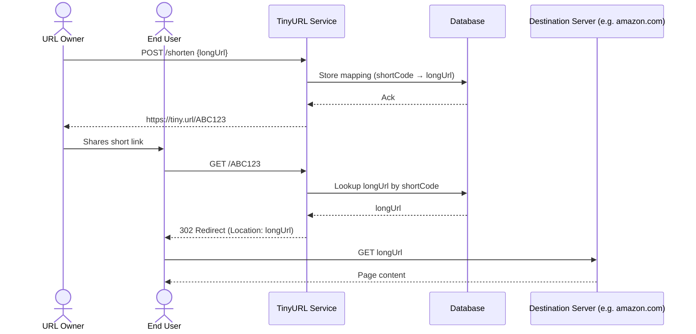
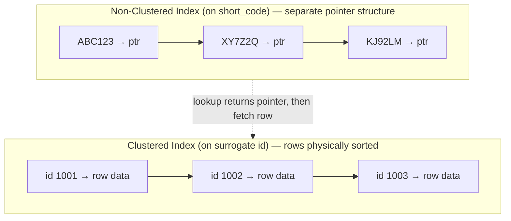
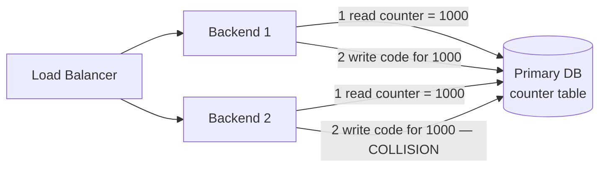
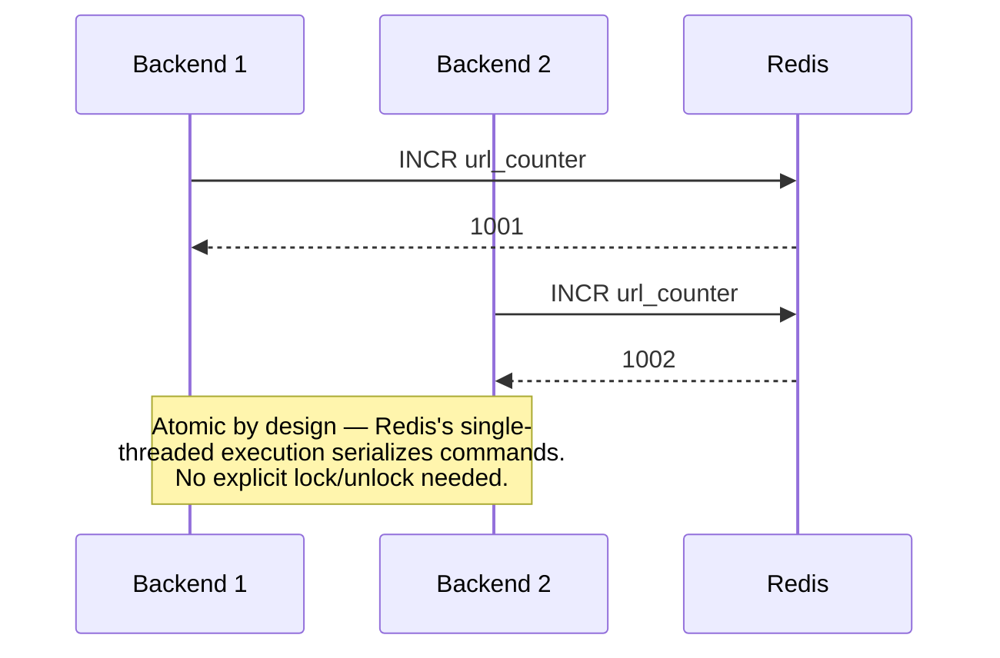
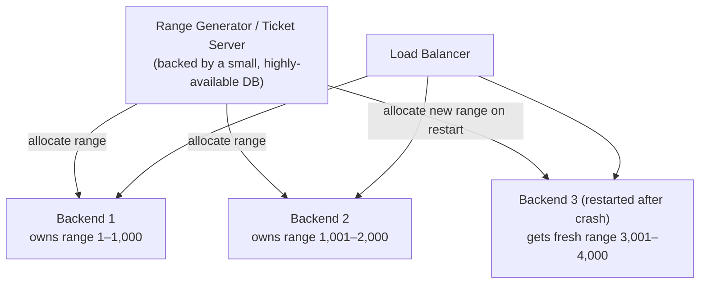
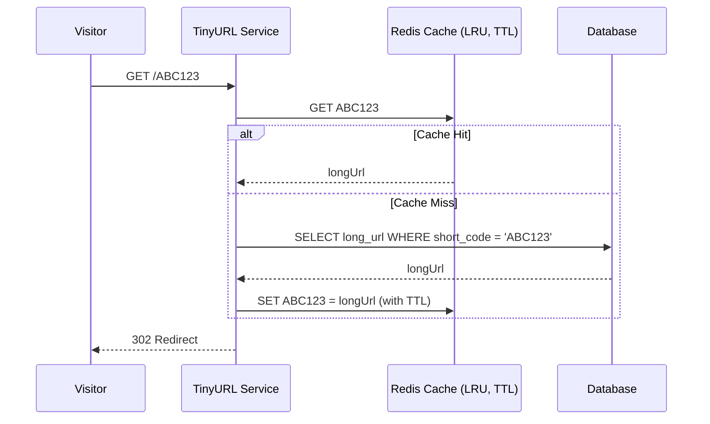
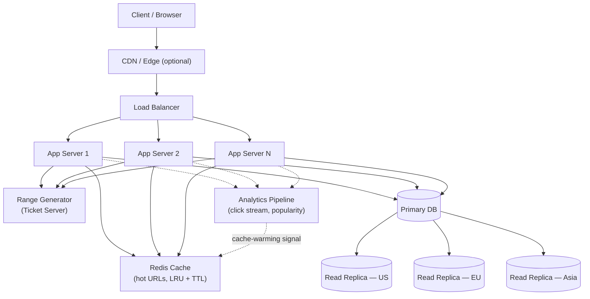

# Designing a URL Shortener (TinyURL) — System Design Study Notes

---

## 1. Problem Statement & Requirements

### 1.1 What We're Building

A user submits a long URL and receives a short alias. When anyone opens the short link, our service looks up the original URL and redirects the browser to it.



**Real-world example:** This is exactly the flow used by **Bitly** and **TinyURL** — and it's also how Slack, Twitter, and SMS platforms handle link previews internally, since long tracking URLs are unwieldy in constrained UI or character-limited contexts.

### 1.2 Functional Requirements

- Convert a long URL into a short, unique URL.
- Redirect users from the short URL to the original long URL.
- Support link expiration (TTL).
- Determine an appropriate short-code length given expected scale.

### 1.3 Non-Functional Requirements

- **Low latency:** p90 latency (i.e., 90% of requests complete faster than this threshold) under **250 ms** for redirects.
- **High availability:** redirects should work even during partial infrastructure failure — a broken short link is a broken user experience across every platform that embedded it.
- **Uniqueness:** no two long URLs should ever collide on the same short code.
- **Scalability:** the system must handle years of accumulated links without performance degradation.

### Key Takeaways — Section 1
- The core flow is **create → store → redirect**, and the redirect target is a separate destination server, not part of our system.
- Non-functional requirements (latency, availability, uniqueness) shape every downstream design decision — always state them before designing.
- p90/p99 latency means "percentile of the latency distribution," not "the Nth user."

---

## 2. Capacity Estimation

### 2.1 Traffic Estimation

Assumptions (typical for an interview-style Fermi estimate):

| Metric | Value |
|---|---|
| Total registered users | 1,000,000 |
| Daily Active Users (DAU) — 50% of total | 500,000 |
| Readers (80% of DAU) | 400,000 |
| Writers (20% of DAU) | 100,000 |
| Links created per writer per day | 1 |
| Links read per reader per day | 1 |

### 2.2 Write QPS

```
Writes/day = 100,000
Write QPS  = 100,000 / 86,400 ≈ 1.16 QPS
```

We round up to **2 QPS** as a deliberate safety buffer.

- Peak write QPS (2× multiplier for traffic spikes): **~4 QPS**

### 2.3 Read QPS

```
Reads/day = 400,000
Read QPS  = 400,000 / 86,400 ≈ 4.63 QPS
```

Rounded up to **5 QPS** baseline, **10 QPS** at peak (2× multiplier).

**Read:write ratio ≈ 4:1** — this is the single most important number in this design, because it tells us to optimize aggressively for read latency (caching, replicas) rather than write throughput.

### 2.4 Total Link Volume (10-Year Horizon)

```
Links/day = 100,000
Links/year = 100,000 × 365 = 36,500,000
Links/10 years = 365,000,000 (~365 million)
```

We'll round up to **400 million** for safety margin in the calculations below.

**Real-world example:** Bitly reportedly processes **billions** of links total and hundreds of millions of clicks per day — our 10-year estimate here is intentionally conservative for a "design it in an interview" scope, but the *method* (DAU → split by read/write → extrapolate) is the same method real infra teams use for capacity planning before a launch.

### 2.5 Short Code Length

We need an alphabet and a length `n` such that `alphabet_size^n ≥ total_links`.

Using Base62 (`A–Z`, `a–z`, `0–9`, no special characters — special characters are avoided because they require URL-encoding and complicate copy-paste/click reliability):

```
62^n ≥ 400,000,000
n ≥ log62(400,000,000)
n ≥ 4.79
```

Round up → **n = 5** is the mathematical minimum. We choose **n = 6** for headroom:

```
62^6 = 56,800,235,584 (~56.8 billion possible codes)
```

That's ~142× more capacity than we need — comfortable margin against faster-than-projected growth.

**Real-world example:** Bitly's short codes are typically **7 characters**; YouTube's video IDs are **11 characters** from a similar Base64-like alphabet — both chose extra headroom over the mathematical minimum for the same reason we did.

### Key Takeaways — Section 2
- Always derive QPS from DAU, not total users — this is the #1 mistake candidates make.
- Read-heavy systems (here, ~4:1 read:write) should be architected around caching and read replicas first.
- Always round your short-code keyspace up from the mathematical minimum — cheap insurance against underestimating growth.

---

## 3. Database Design & Storage

### 3.1 Schema

| Column | Type / Size | Notes |
|---|---|---|
| `id` (surrogate PK) | BIGINT, 8 bytes | Auto-increment, clustered index (see §3.3) |
| `short_code` | VARCHAR(6–8), ~8 bytes | Unique index, NOT NULL |
| `long_url` | VARCHAR(2048), ~255 bytes avg | The original URL |
| `created_at` | 8 bytes | For analytics / expiry |
| `expires_at` | 8 bytes (nullable) | Supports link-expiry requirement |

We store only the 6-character code rather than a full short URL string — the app layer prepends the domain (`https://tiny.url/`) at read time, which is both cheaper and lets us rebrand or move domains without touching stored data. (If custom/branded domains are a product feature, as with Bitly, size the column for the longest supported custom domain instead.)

### 3.2 Storage Calculation

Using a representative row size of ~305 bytes (id + code + URL + timestamps, with some slack):

```
Rows in 10 years  ≈ 400,000,000
Row size          ≈ 305 bytes
Raw data size     ≈ 400,000,000 × 305 bytes ≈ 122 GB
```

Add **20–30% index overhead** (unique index on `short_code`, plus any secondary indexes) and plan for roughly **150 GB** of provisioned storage — still comfortably small for a single modern managed database instance.

### 3.3 Indexing: Clustered vs. Non-Clustered

A **clustered index** determines the *physical* on-disk ordering of rows — there can be only one per table, because data can only be physically sorted one way. A **non-clustered index** is a separate structure that stores index-key → row-pointer mappings, letting you query on other columns without a full table scan, at the cost of an extra lookup hop plus write amplification.



Physical clustering-on-primary-key-by-default is true for engines like **MySQL's InnoDB**, but not universal — PostgreSQL, for example, uses heap-organized tables by default and only clusters physically if you explicitly run `CLUSTER`. Worth naming the engine explicitly when making this claim in an interview.

At scale, using the **short code itself** as the clustered primary key is worth avoiding. Short codes are effectively random strings, and inserting random values into a clustered B-tree causes **page splits** — the database constantly reshuffles disk pages to keep them sorted, which hurts write throughput and causes fragmentation. The better pattern: use a **surrogate auto-increment integer** (`id`) as the clustered primary key (monotonically increasing → inserts always append to the end of the B-tree, no page splits), and put a separate **unique non-clustered index** on `short_code` for lookups. Lookup cost becomes: non-clustered index seek (O(log n)) → pointer → clustered row fetch (O(log n)) — still logarithmic, just one extra hop, which is a good trade for much better write performance.

**Real-world example:** this exact pattern (surrogate integer PK + unique secondary index on the "natural" business key) is standard practice in high-write systems like **payment processors' transaction tables** and **Instagram's Postgres-backed media ID tables** — natural-looking keys (usernames, hashes, codes) are almost never good clustered keys at scale.

If a future requirement is "fetch all links created by a given user" (a range/sequential-scan-friendly query), you'd want a secondary index on `user_id` — a good example of **letting query patterns, not intuition, drive index design**.

### Key Takeaways — Section 3
- Only store what you need in the DB row (code, not full domain) unless custom domains are a real feature.
- One clustered index per table; design it around your dominant access pattern, not the "obvious" business key.
- Prefer a monotonically increasing surrogate key as the clustered index to avoid B-tree page-split overhead on writes.

---

## 4. Unique Short-Code Generation Strategies

This is the crux of the interview — there are four common approaches, each with real trade-offs.

### 4.1 Approach 1: Naive Counter in the Primary DB

Each backend reads a shared counter from the database, increments it, and uses the new value to derive a short code (e.g., base62-encode the integer).



**Problems:**
- **Race condition:** two backends can read the same counter value simultaneously and generate the same code before either writes back.
- **Double round-trip:** read counter → generate code → write mapping = two hops to the DB per request.
- **Single point of failure:** the DB is now both the bottleneck and the source of truth for correctness.

### 4.2 Approach 2: Hashing the Long URL

Feed the long URL into a hash function (e.g., MD5/SHA-256), then base62-encode and truncate the first 6–8 characters.

Truncating a cryptographic hash to 6–8 characters will eventually produce collisions (birthday paradox — with a 62^6 ≈ 56.8B keyspace, collisions become likely once you have generated roughly the square root of that space, ~240,000 codes, per the birthday bound). Resolution strategies:
- Check-and-retry: on collision, append a salt/counter and re-hash.
- Accept the DB uniqueness constraint will reject the insert, catch that, and retry with a different truncation offset or salt.

This approach avoids a shared counter (good for statelessness) but still needs a uniqueness check on write, and hashing is CPU work you pay on every request.

### 4.3 Approach 3: Distributed Counter via Redis

Redis executes commands **single-threaded**, which means increment operations are naturally atomic — no explicit application-level lock is required.



Redis already provides `INCR` as an atomic primitive, so there's no need for a manual lock/unlock dance — that pattern is reserved for coordinating more complex multi-step critical sections (via `SETNX` or the RedLock algorithm), not simple counters.

**Trade-offs:**
- **Cost:** an additional managed in-memory data store is a real line-item cost at scale.
- **Availability:** if Redis goes down, the counter's in-memory state is at risk. Redis persistence (RDB snapshots or AOF logs) mitigates but doesn't eliminate this — a snapshot restore can lose the last few increments, which risks handing out a code that was already used.

### 4.4 Approach 4 (Recommended): Range Handler / Ticket Server

A dedicated, lightweight service pre-allocates **contiguous ranges** of IDs to each backend instance. Each backend then generates codes locally from its own range without contacting any shared state per-request.



**How it works:**
- The range generator hands each backend a block (e.g., 1,000 IDs) up front.
- The backend increments through its local range **in memory** — zero network calls per request.
- If a backend crashes mid-range (e.g., after using only 499 of 1,000), the unused remainder (500–1,000) is simply abandoned when it restarts and requests a *new* range. This wastes a small number of IDs but guarantees no two backends ever collide, and avoids needing distributed coordination on every write.
- Adding new backend instances is simple: the range generator just allocates the next unused block — existing backends are unaffected.
- The range generator itself is made highly available by fronting it with a load balancer and running multiple instances backed by a small, durable data store (it only needs to track "the next unallocated range," so its own write volume is tiny compared to the main system).

**Real-world example:** this is essentially the **"Ticket Server" pattern used by Flickr** (documented in their engineering blog) for distributed unique ID generation, and it's conceptually similar to how **Twitter's Snowflake** and **Instagram's ID generation scheme** decentralize ID allocation to avoid a single shared counter becoming a bottleneck — though Snowflake instead encodes timestamp + machine ID + sequence directly into the ID, avoiding a central allocator entirely. Both solve the same problem (unique IDs without contention) via different mechanisms — worth mentioning both if asked to compare.

### 4.5 Comparison

| Approach | Collision Risk | SPOF Risk | Extra Round-Trips | Cost |
|---|---|---|---|---|
| Naive DB counter | High (race condition) | High | 2 per write | Low |
| Hashing | Low but non-zero | Low | 1 (uniqueness check) | Low (CPU-bound) |
| Redis atomic counter | None | Medium (Redis down = risk) | 1 per write | Medium–High |
| Range handler / ticket server | None | Low (range-isolated) | ~0 (amortized) | Low–Medium |

### Key Takeaways — Section 4
- The range/ticket-server pattern is generally the best fit here: no per-request coordination, no collisions, and graceful handling of backend crashes at the cost of a few wasted IDs.
- Redis's `INCR` is already atomic — don't reach for manual locking unless you need multi-step atomicity.
- Always ask "what happens when a backend crashes mid-range/mid-counter?" — it's the natural follow-up question and the ticket-server design answers it cleanly.

---

## 5. Redirect Semantics: 301 vs. 302

| | 301 (Permanent Redirect) | 302 (Temporary Redirect) |
|---|---|---|
| Browser caching | Browser **caches** the redirect and may skip our server on future clicks | Browser does **not** cache; every click hits our server |
| Analytics | Weakened — cached clicks never reach our servers, so click counts undercount | Accurate — every click is observed and can be logged |
| Server load | Lower (repeat visits bypass us) | Higher (every click is a request) |
| Use case | Static, permanent redirects where you don't need click analytics | Default choice for URL shorteners, since click analytics is usually a core product feature |

**Real-world example:** Bitly and most commercial link shorteners use **302** by default specifically because click analytics (geography, device, referrer, click timestamp) is part of the product value — a 301 would silently break that after the first click from any given browser.

### Key Takeaways — Section 5
- Prefer 302 unless you explicitly don't care about per-click analytics.
- This single choice has a direct trade-off between server load and data visibility — always call it out explicitly in an interview.

---

## 6. Caching Hot URLs

A small fraction of short links (celebrity tweets, viral posts, marketing campaigns) receive a disproportionate share of clicks — a classic **Zipfian / power-law** access distribution. Caching these avoids hitting the database for the same lookups repeatedly.



This is the standard **cache-aside** pattern: the application checks the cache first, falls back to the DB on a miss, and populates the cache on the way back. An **LRU (Least Recently Used)** eviction policy keeps memory usage bounded while naturally favoring hot links.

An LRU cache with a reasonable TTL will organically retain hot keys because they're accessed frequently by definition — a separate analytics pipeline (click counts, geography, referrers) is valuable for **product** reporting and can additionally be used as a cache-warming signal, but isn't strictly required just to make caching work.

**Real-world example:** **Netflix** uses a similar cache-aside pattern with **EVCache** (their Memcached-based caching layer) to serve popular metadata without hammering their primary datastore, and CDNs like **Cloudflare** apply the same Zipfian-distribution logic to edge-cache popular redirect targets closer to users.

### Key Takeaways — Section 6
- Cache-aside + LRU + TTL handles the "hot URL" problem effectively on its own.
- Analytics is a valuable *product* feature (and a nice source of cache-warming signals), but treat it as additive, not a blocking dependency for caching to work.

---

## 7. Putting It All Together: Full System Architecture



**How the pieces fit our earlier numbers:**
- **~10 QPS peak read / 4 QPS peak write** is comfortably handled by a single primary + regional read replicas, with the Redis cache absorbing the hottest reads before they ever reach the DB.
- The **range handler** removes per-write coordination overhead, matching our low but non-trivial write QPS.
- **Regional replicas** (US/EU/Asia) address global latency for the read-heavy workload and give us redundancy if the primary's region has an outage — reads can be served from the nearest healthy replica while writes fail over via standard primary-election mechanisms (e.g., Postgres streaming replication with automatic failover, or a managed service's built-in HA).

### Infrastructure Cost Notes

A reasonable illustrative cost model: ~$1,500/month per database instance, with a primary plus three regional replicas landing around **$6,000/month**. Actual costs depend heavily on cloud provider, instance size, storage tier, and region — treat these as a way to demonstrate you understand what drives cost (compute, memory, storage, replication factor) rather than as numbers to defend precisely, and check current pricing for the specific provider and instance class you plan to use when budgeting for real.

### Key Takeaways — Section 7
- Every component in the final architecture maps directly back to a requirement or a capacity number from Section 2 — that traceability is what a Staff Engineer is listening for.
- Multi-region replicas primarily serve **read latency and availability**, not write scaling — writes still funnel through the primary.

---

## 8. Interview Framing Summary

| Requirement | Design Decision |
|---|---|
| Uniqueness, no collisions | Range handler / ticket server allocates non-overlapping ID blocks |
| p90 < 250ms | Cache-aside layer + regional read replicas + CDN |
| Read-heavy (4:1) workload | Optimize for cache hit rate and replica read scaling over write throughput |
| 10-year growth to ~400M links | Base62, 6-character codes (56.8B keyspace) |
| High availability | Load-balanced stateless app servers, HA range handler, multi-region replicas |
| Link expiry | `expires_at` column, periodic cleanup job or lazy expiry check on read |

This structure — requirements → estimation → schema → core algorithm → scaling/availability — is the standard shape for any system design interview, not just this one. The URL shortener is a good vehicle for it because every layer (ID generation, indexing, caching, redirect semantics) has a genuinely interesting trade-off, rather than being an arbitrary example.