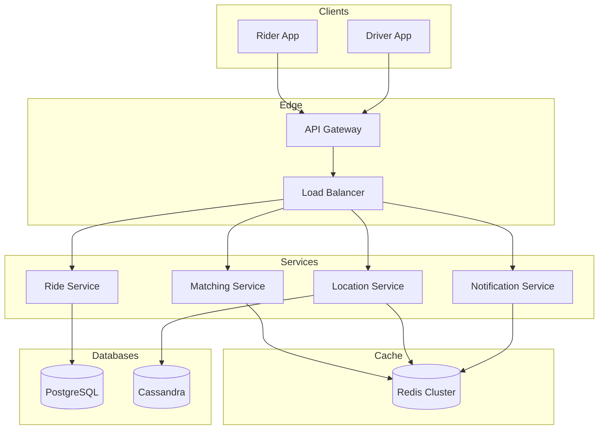
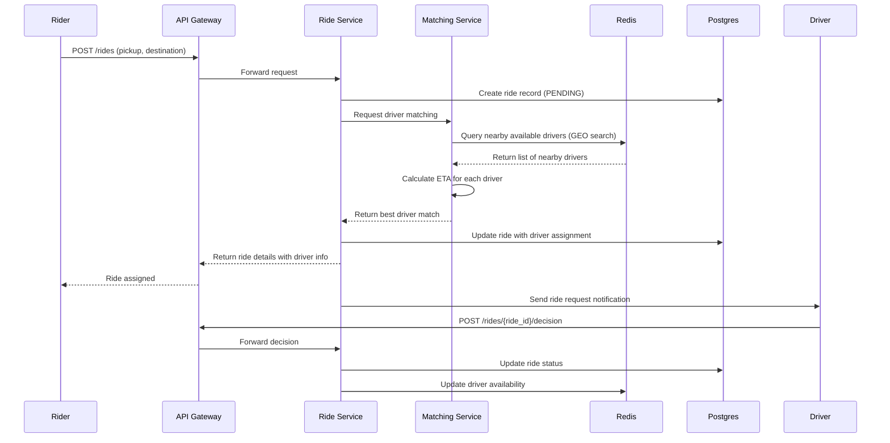
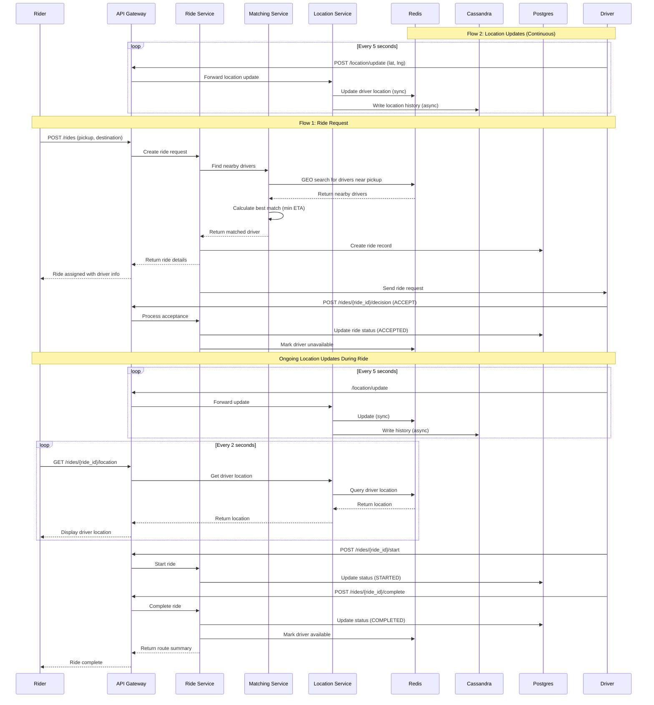
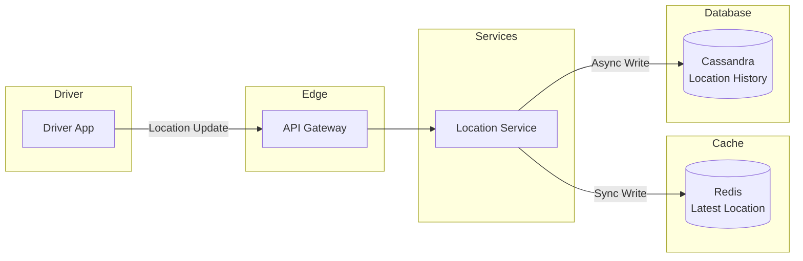
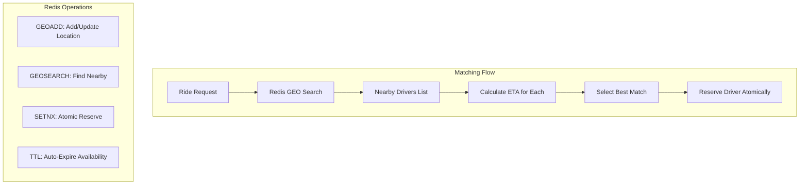
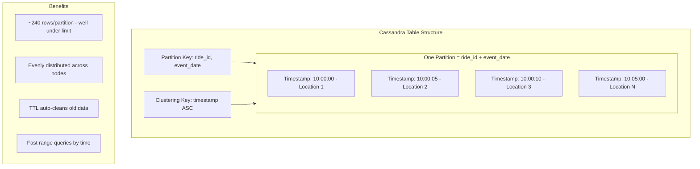
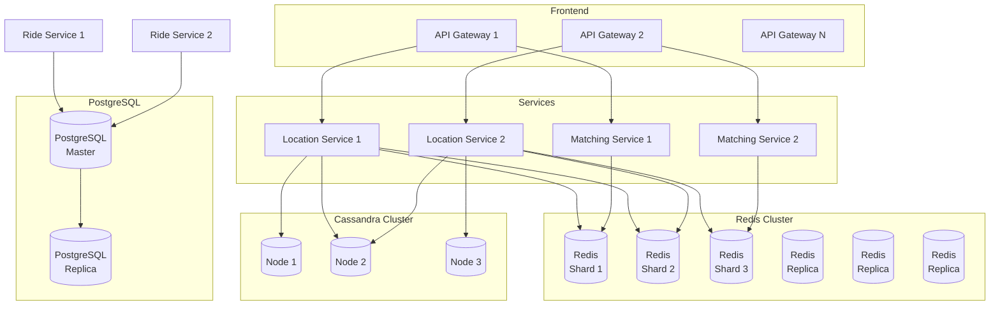
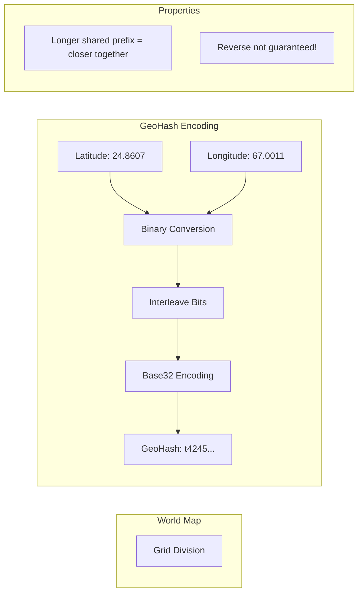
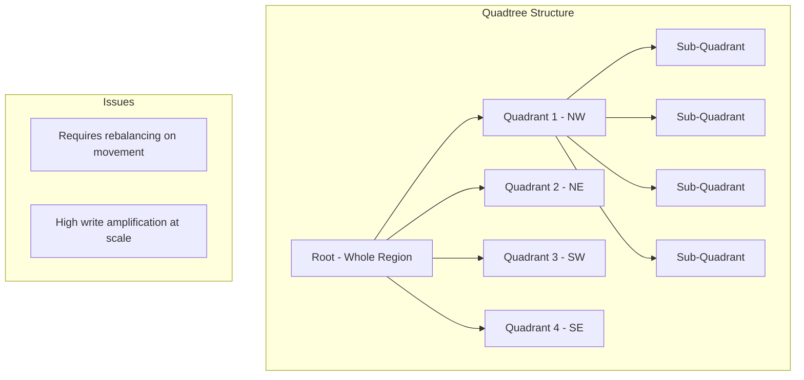
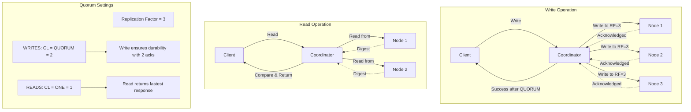

# How Uber Finds Nearby Drivers In Real Time

## 1. Uber

- On-demand ride-hailing platform
- Connects riders with nearby drivers in real-time
- Available in 10,000+ cities globally
- Millions of rides completed daily

---

## Functional Requirements

- Riders can request a ride by providing pickup and destination location
- System finds all nearby available drivers and matches them with the driver having least ETA
- Riders can see the assigned driver's live location as they approach
- Drivers periodically send location updates
- Drivers can accept/reject a ride request
- Once ride is complete rider can see the entire route of ride

## Non-Functional Requirements

- Rider matching latency < 300ms
- Strong consistency for ride matching
- Eventual consistency for location updates
- System must be highly available
- System should be able to work during peak traffic
- System must be able to handle 10% user growth each year.

---

## Assumptions & Scale

### User Assumptions:

- MAU: 180M
- DAU: 20% → 36M DAU
- Daily trips (2 per active user): 72M

### Driver Assumptions:

- 1.2M Daily Active Drivers

### Ride Requests:

- 72M trips/day ≈ 834 requests/sec average
- Peak (×10): ~8,500 QPS

### Location Updates → Every 5 Seconds

- 1 sec → 0.2 updates requests
- 1.2M active driver * 0.2 updates requests
- 240,000 updates/second

---

## Storage

| Entity | Stored In |
|--------|-----------|
| User | PostgreSQL |
| Driver | PostgreSQL |
| Ride | PostgreSQL |
| Driver Location | Redis |
| Driver Availability | Redis |
| Trip Location History | Cassandra |

### Storage Notes:

- **Active Drivers: 1 Million** → Live Data: In-memory processing crucial for real-time
- **Driver Location Updates: Write-Intensive** → 240,000 Writes/sec → Requires high-throughput write store (for history) & fast updates (for real-time index)
- **Ride Requests: Read-Intensive** → 8,500 Reads/sec → Low-latency read store for spatial queries
- **Rides per Day: 72 Million** → Scalable transactional store for trip records

---

## Storage Requirements

### Row Size Calculations

- **Rider:** 4 + 50 + 50 + 100 + 20 + 200 + 8 + 8 = 440 bytes
- **Driver:** 4 + 50 + 50 + 100 + 20 + 50 + 20 + 8 + 8 + 8 = 318 bytes
- **Location:** 4 + 4 + 4 + 8 + 8 + 8 = 32 bytes
- **Ride:** 4 + 4 + 4 + 8 + 8 + 8 + 8 + 8 + 8 + 8 + 20 + 8 + 8 = 112 bytes

### Table Size

- **Ride:** 112 bytes × 26,280,000,000 rides = 2,741.46 GB
- **Rider:** 440 bytes × 180,000,000 users = 73.75 GB
- **Driver:** 318 bytes × 5,000,000 drivers = 1.48 GB
- **Location:** 32 bytes × 1,000,000 active drivers = 0.03 GB

---

## Growth Estimates

Assuming 10% Growth Each Year

| Year | Rides (GB) | Riders (GB) | Drivers (GB) | Locations (GB) | Cumulative Storage (GB) |
|------|------------|-------------|--------------|----------------|-------------------------|
| 1 | 2,741.46 | 73.75 | 1.48 | 0.03 | 2,816.72 |
| 2 | 3,015.61 | 81.13 | 1.63 | 0.03 | 5,915.12 |
| 3 | 3,317.17 | 89.24 | 1.79 | 0.04 | 9,323.36 |
| 4 | 3,648.89 | 98.16 | 1.97 | 0.04 | 13,072.42 |
| 5 | 4,013.78 | 107.98 | 2.17 | 0.04 | 17,196.39 |

---

## High-Level Design (HLD)



---

## API Endpoints

### 1. Request Ride
```
POST /rides
Request: {
  "pickup": {"lat": 24.8607, "lng": 67.0011},
  "destination": {"lat": 24.9056, "lng": 67.0822}
}
```

### Flow1: Ride Request



---

### 2. Driver Accept/Reject
```
POST /rides/{ride_id}/decision
{
  "driver_id": "uuid",
  "decision": "ACCEPT" | "REJECT"
}
```

### 3. Start Ride
```
POST /rides/{ride_id}/start
```

### 4. Complete Ride
```
POST /rides/{ride_id}/complete
Response: {
  "ride_id": "uuid",
  "status": "COMPLETED",
  "route_summary": {
    "distance_km": 12.4,
    "duration_sec": 1520
  }
}
```

---

## Sequence Diagram



---

## Flow 2: Location Updates

### Scale
- 72M rides/day
- 240 updates/ride
- ~17.3B rows/day

### Goal
- No large or hot partitions
- Fast route reads
- Horizontal scaling
- Complete ride route (using Cassandra)
- Redis keeps the latest location



---

## Ride Request & Matching: Key Decisions

### Why Redis?

- In-memory, sub-millisecond geo queries
- Handles massive concurrent reads/writes
- Horizontally scalable via sharding

### GeoHash vs Quadtree

- Quadtree requires rebalancing on movement
- High write amplification at scale
- GeoHash supports O(1) location updates
- Natively supported by Redis

### Consistency & Availability

- **Strong Consistency:** Atomic Writes
- **TTLs:** Prevent stale driver availability
- **Redis:** Real time coordination
- **Postgres:** ACID ride lifecycle



---

## Driver Location Updates: Key Decisions

### Cassandra: High Volume Writes

- Massive write throughput + append only
- Time series data
- Masterless + no SPOF

### Rider Updates

- **Websockets:** Persistent connections
- **Streaming VS Polling:** Low latency + high frequency updates

### Cassandra Partitioning Strategy

**Schema:**
- **PK:** ((ride_id, event_date), timestamp)
- **Partition:** ride_id + event_date
- **Clustering:** timestamp ASC

### Why ride_id?

- One ride = one bounded time-series
- ~240 rows/partition (<<100k limit)
- 72M partitions/day → evenly distributed
- TTL (e.g., 90 days) caps storage



---

## Scaling & Load Management

### Horizontal Scaling

- **Stateless Services:** API Gateway, Location Service, Matching Service
- **Redis + Cassandra:** Distribute load & inherent fault tolerance

### Vertical Scaling

- **PostgreSQL:** Early stage + simplicity for ACID

### Data Durability & Recovery

**Redis Cluster:**
- 1 Master + 1 Replica per shard

**Cassandra:**
- Replication Factor = 3
- WRITES → CL = QUORUM
- READS → CL = ONE
- Peer-to-Peer Replication



---

## Appendix

### GeoHashing



**Key Point:** Longer the shared prefix between two geohashes, the spatially closer they are together. The reverse of this is not guaranteed!

### Quad Trees



---

## Appendix: Replication and Quorums in Cassandra

